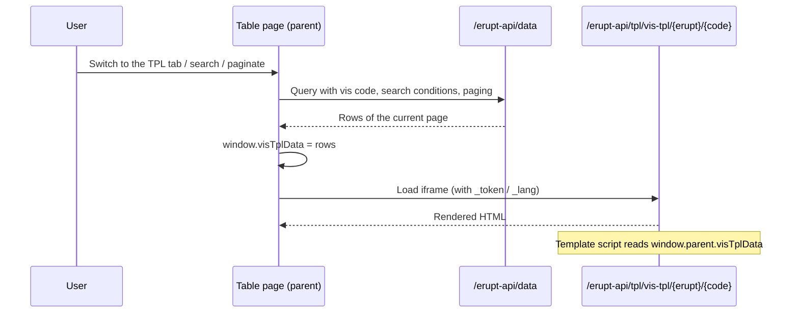

# Custom View TPL

When none of the built-in table, card, Gantt, board, or calendar views fit, use `@Vis(type = Vis.Type.TPL)` to mount a **page you write yourself** as a view tab. The backend renders HTML through a template engine, the frontend embeds it full-page in an iframe, and the current query result is handed to the template, so your custom page shares the same search, filter, and pagination as the table.

:::tip
Add the [erupt-tpl](/en/modules/erupt-tpl/) module first, otherwise no template engine is registered. See [@Tpl Custom Template](/en/annotation/tpl) for the full attribute reference.
:::

## Complete Example

```java
@Entity
@Table(name = "t_order")
@Erupt(
    name = "Order",
    visRawTable = true,
    vis = {
        @Vis(
            code = "chart",                              // required, used to locate the render endpoint
            title = "Sales Trend",
            type = Vis.Type.TPL,
            tplView = @Tpl(path = "/tpl/order-chart.ftl", height = "600px"),
            filter = @Filter("status = 'PAID'")           // per-view filter, also applied to the data the template receives
        )
    }
)
public class Order extends BaseModel {

    @EruptField(
        views = @View(title = "Order No."),
        edit = @Edit(title = "Order No.", notNull = true)
    )
    private String orderNo;

    @EruptField(
        views = @View(title = "Amount"),
        edit = @Edit(title = "Amount", notNull = true)
    )
    private BigDecimal amount;

    @EruptField(
        views = @View(title = "Status"),
        edit = @Edit(title = "Status", type = EditType.CHOICE,
            choiceType = @ChoiceType(vl = {@VL(value = "PAID", label = "Paid"), @VL(value = "PENDING", label = "Pending")}))
    )
    private String status;

    @EruptField(
        views = @View(title = "Created At"),
        edit = @Edit(title = "Created At", search = @Search(vague = true))
    )
    private Date createTime;
}
```

Template `src/main/resources/tpl/order-chart.ftl`:

```html
<!DOCTYPE html>
<html>
<head>
    <meta charset="UTF-8">
    <script src="${base}/tpl/js/echarts.min.js"></script>
</head>
<body style="margin:0">
<div id="chart" style="width:100%;height:100vh"></div>
<script>
    // The parent page exposes the current page's query result on window.parent.visTplData
    const rows = window.parent.visTplData || [];
    const chart = echarts.init(document.getElementById('chart'));
    chart.setOption({
        xAxis: {type: 'category', data: rows.map(r => r.orderNo)},
        yAxis: {type: 'value'},
        series: [{type: 'bar', data: rows.map(r => r.amount)}]
    });
</script>
</body>
</html>
```

## How It Works



1. **Query**: switching to the TPL tab, searching, paginating, or sorting triggers a table data query. The request carries the `code` of the current `@Vis`, so the view's `filter` / `orderBy` and the search conditions above the table all apply.
2. **Data injection**: once the query completes, the frontend writes the current page's rows to `window.visTplData` on the parent window and only then renders the iframe. The template script reads them via `window.parent.visTplData`.
3. **Template rendering**: the iframe points at `/erupt-api/tpl/vis-tpl/{erupt}/{code}`; the server renders the template with the engine specified in `tplView`. The endpoint checks the user's permission on the entity and evaluates the `@Vis.show` expression, returning an authorization error if either fails.
4. **Refresh**: at the start of every query `visTplData` is cleared and a loading spinner is shown; when the query completes the iframe is **reloaded**. The template does not need to watch for changes, it just reads the data once on page load.

## Key Constraints

| Item | Description |
|---|---|
| `code` | **Required**. The render endpoint locates the view by `code`; an empty value cannot be loaded |
| `height` | Height of the view container, with unit; when omitted it adapts to the browser window height |
| Effective `@Tpl` attributes | `path` / `engine` / `tplHandler` / `params` / `height`; `width` / `openWay` / `embedType` / `drawerPlacement` / `enable` have no effect here |
| Built-in template variables | `request`, `response`, `base` (application context path), plus any `?k=v` variables appended to `path` |
| Row data | **Current page only**, same structure as the table API; reference fields are flattened as `field_property`, e.g. `dept_name` |
| Pagination | The pager remains visible under a TPL view; adjust the page size to control how many rows the template receives |

:::warning Current page only
`visTplData` is the paginated result, not the whole table. If a chart needs full-table statistics, raise the page size or query the data yourself in a [TplHandler](#server-side-preprocessing-tplhandler) and inject it into the template.
:::

## Server-Side Preprocessing: TplHandler

When you need to aggregate on the server (for example, count the whole table instead of the current page), inject variables through `tplHandler`:

```java
@Vis(
    code = "summary", title = "Summary",
    type = Vis.Type.TPL,
    tplView = @Tpl(path = "/tpl/order-summary.ftl",
                   tplHandler = OrderSummaryHandler.class,
                   params = {"PAID"})
)
```

```java
@Component
public class OrderSummaryHandler implements Tpl.TplHandler {

    @Resource
    private EruptDao eruptDao;

    @Override
    public void bindTplData(Map<String, Object> binding, String[] params) {
        binding.put("total", eruptDao.lambdaQuery(Order.class)
                .eq(Order::getStatus, params[0])
                .count());
    }
}
```

Use `${total}` directly in the template. `tplHandler` is not available when `engine = Native`.

## Combining With Other Views

A TPL view can sit alongside other `@Vis` types, each tab with its own `filter` / `orderBy` / `show`:

```java
@Erupt(
    name = "Order",
    visRawTable = true,
    vis = {
        @Vis(title = "Board", type = Vis.Type.BOARD, boardView = @BoardView(groupField = "status")),
        @Vis(code = "chart", title = "Trend", type = Vis.Type.TPL,
             tplView = @Tpl(path = "/tpl/order-chart.ftl"),
             show = @ExprBool(exprHandler = AdminOnlyHandler.class))
    }
)
```

When `show` evaluates to `false` the tab is hidden and the server-side render endpoint also rejects the request, so it cannot be bypassed by opening the URL directly.
