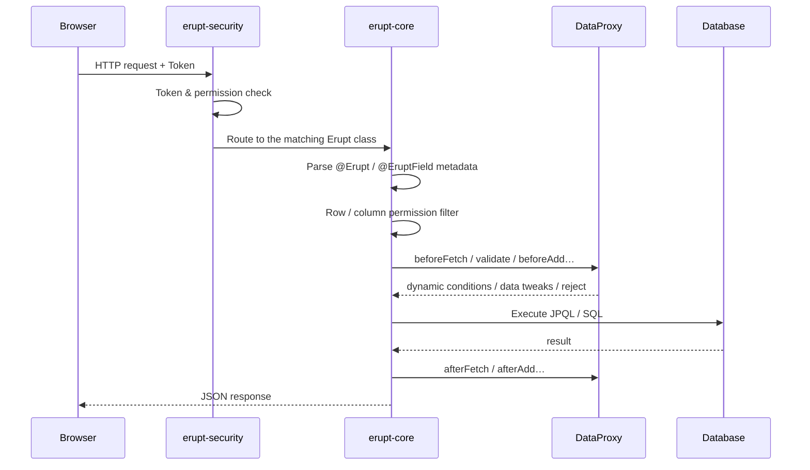
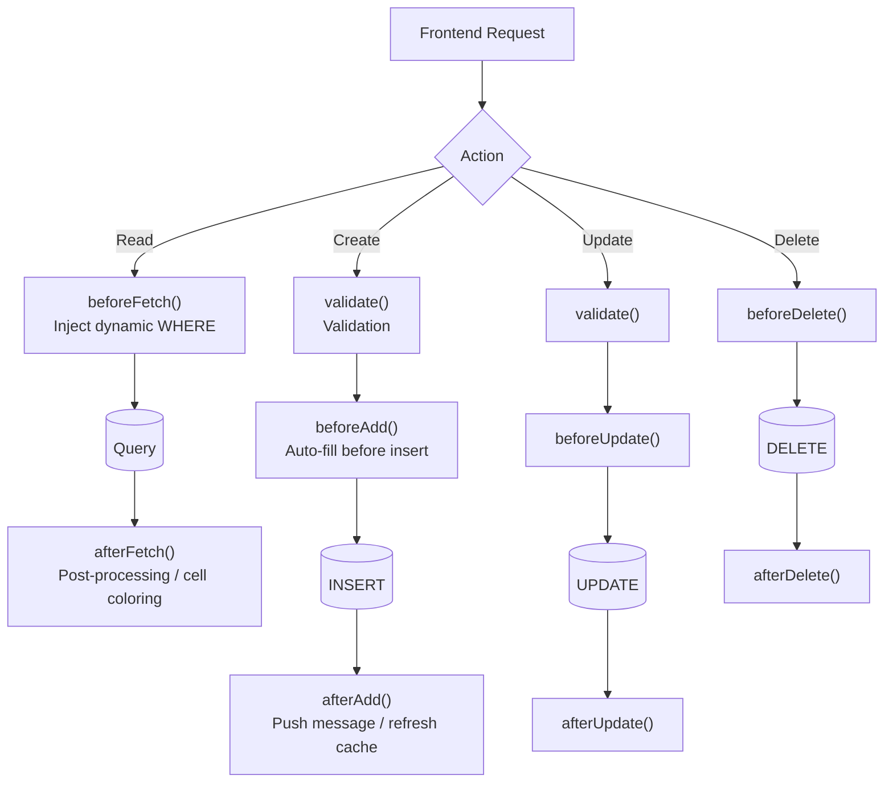
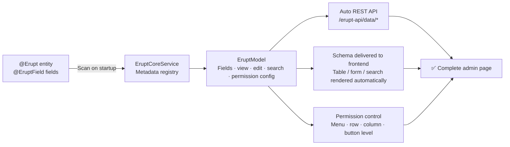
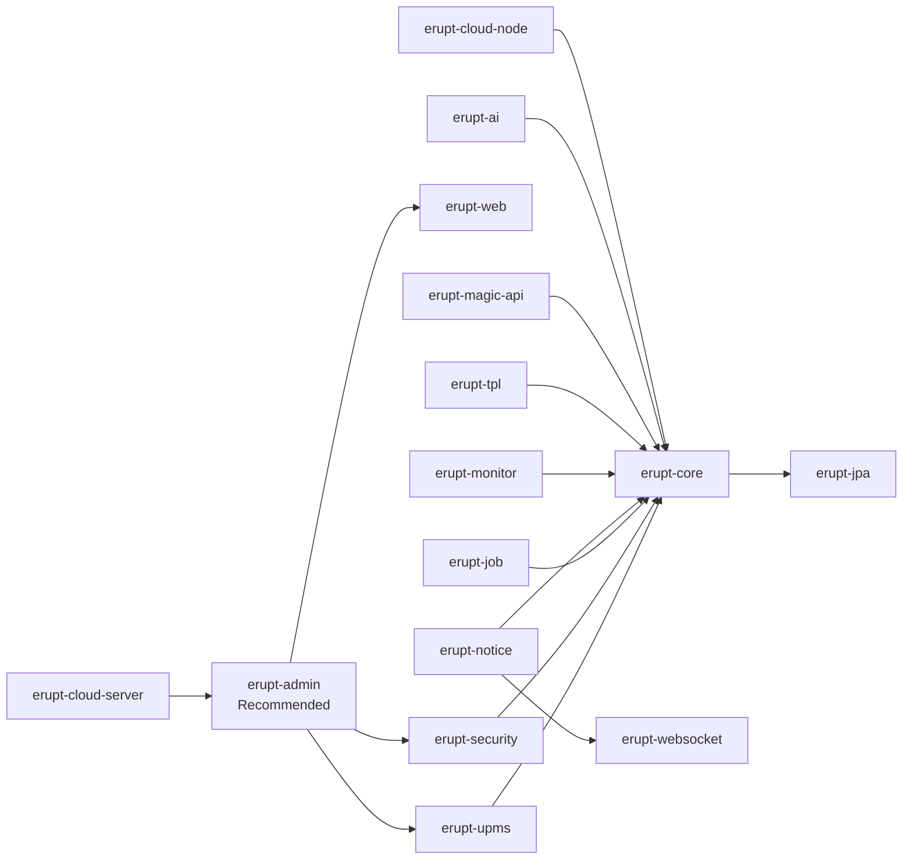

# Architecture


## Feature Map


## Functional Architecture


---

## Layered Architecture

Erupt follows a modular layered design — each layer has clear responsibilities and can be pulled in on demand.

```mermaid
graph TB
    subgraph Frontend
        Web["erupt-web\nAngular admin UI (jar)"]
    end

    subgraph Security
        Security["erupt-security\nJWT / Session auth"]
    end

    subgraph Core
        Core["erupt-core\nAnnotation parsing · CRUD engine · Schema delivery"]
        UPMS["erupt-upms\nUsers · Roles · Menus · Orgs"]
    end

    subgraph Data
        JPA["erupt-jpa\nSpring Data JPA · multi-source · auto schema"]
        Mongo["erupt-mongodb\nMongoDB NoSQL"]
    end

    subgraph Extensions
        Job["erupt-job\nScheduled jobs"]
        Notice["erupt-notice\nNotifications"]
        Monitor["erupt-monitor\nService monitoring"]
        Tpl["erupt-tpl\nCustom pages"]
        Cloud["erupt-cloud\nDistributed"]
        AI["erupt-ai\nLLM integration"]
    end

    Web --> Security
    Security --> Core
    Core --> UPMS
    Core --> JPA
    Core --> Mongo
    Core -.-> Job & Notice & Monitor & Tpl & Cloud & AI
```

## Request Lifecycle

The full pipeline of a CRUD request inside the framework:



## DataProxy Lifecycle

DataProxy is Erupt's Service layer and exposes lifecycle hooks for every CRUD action:



## Annotation-Driven Pipeline

How a Java class turns into a complete admin page:



## Module Dependencies



## Distributed Architecture (erupt-cloud)

```mermaid
graph TB
    Browser["Admin Browser"] --> Server

    subgraph Server
        Server["erupt-cloud-server\nRegistry · auth · dispatch"]
        Redis[("Redis\nSession sharing")]
        Server --- Redis
    end

    Server <-->|"WebSocket heartbeat\nConfig push / request forwarding"| NA
    Server <-->|"WebSocket heartbeat"| NB
    Server <-->|"WebSocket heartbeat"| NC

    subgraph "Node A (Notifications)"
        NA["erupt-cloud-node\nMessage templates · channels"]
        DBA[("DB-A")]
        NA --- DBA
    end

    subgraph "Node B (Gateway)"
        NB["erupt-cloud-node\nTimeout · throttling · routing"]
        DBB[("DB-B")]
        NB --- DBB
    end

    subgraph "Node C (Algorithm Service)"
        NC["erupt-cloud-node\nPrompts · algorithm rules"]
        DBC[("DB-C")]
        NC --- DBC
    end
```
