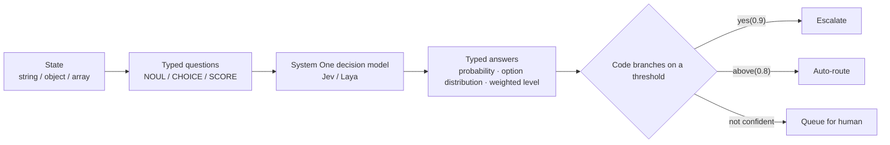

# Erupt AI Decision <Badge type="tip" text="v2.3.0+" />

erupt-ai-decision gives business code **AI judgements it can branch on directly**. Instead of having an LLM write a paragraph that you then parse, it puts **typed questions** to a System One decision model
and gets typed answers back with a probability distribution: the probability of yes, the winner among a closed set of options, a weighted position across ordered levels. Your code branches on a threshold — no regex, no JSON parsing, no prompt engineering.

:::info Repository
[https://github.com/erupts/erupt/tree/master/erupt-ai/erupt-ai-decision](https://github.com/erupts/erupt/tree/master/erupt-ai/erupt-ai-decision)
:::

## Getting Started

1. Add the dependency (depends only on erupt-data-jpa; erupt-ai is **not** required and upms is never read):

```xml
<dependency>
    <groupId>xyz.erupt</groupId>
    <artifactId>erupt-ai-decision</artifactId>
    <version>${erupt.version}</version>
</dependency>
```

`erupt-spring-boot-starter-all` already includes this module.

2. After startup, the **AI Decision** menu group is added with two menus: **Decision** and **Decision Model**.

## What It Solves

When you ask an LLM whether a ticket "is urgent", the usual approach is to write a prompt, get a sentence back, and guess its meaning with string matching or JSON parsing.
The result is unstable, cannot be quantified, and every prompt tweak may break the parser.

A decision model works differently: **the question carries a type, and the answer is a probability distribution**. Ask "Is this urgent?" and you get `0.93`, not "Yes, I think this is urgent";
ask "Which team should handle this?" and you get `BILLING` plus the probability of every option. The threshold lives in your code; the model only judges.



The three primitive question types (`PrimitiveType`):

| Type | Asks | Answers | Typical use |
|---|---|---|---|
| **NOUL** | Yes / no | Probability of yes (0–1) | `yes(0.9)`: treat as yes only above a threshold |
| **CHOICE** | One option from a closed set | Winner + probability of every option | `above(0.8)`: route when confident enough, otherwise hand to a human |
| **SCORE** | Position across ordered levels | Probability-weighted position, may land between levels (e.g. `1.05`) | Mood / risk / priority scoring |

:::tip
A NOUL answer is itself a probability and reports no separate confidence; CHOICE and SCORE answers carry a 0–1 confidence that tells you whether to act on the judgement.
:::

## Configuring Decision Models

Go to **AI Decision → Decision Model** and create a model connection. Picking a provider fills in that provider's default API domain and model name.

| Provider | Description | Default API Domain | Default Model |
|---|---|---|---|
| **TypeSafe Jev** | TypeSafe's hosted System One model, metered, needs an API key; CHOICE accepts up to 255 options | `https://api.typesafe.ai` | `jev-latest` |
| **Laya** | Convai Innovations' Apache 2.0 open-source model, runs locally, see [Running Laya Locally](#running-laya-locally) | `http://127.0.0.1:8000` | `auto` |

| Field | Description |
|---|---|
| **Name** | Connection name; both `using("name")` and the HTTP `?model=` parameter address it |
| **Provider** | TypeSafe Jev / Laya |
| **Model** | Jev: an alias such as `jev-latest`, or a pinned version; Laya: `auto` / `english` / `multilingual` / `typed-decisions` |
| **API Domain** | Provider address; requests are posted to `{API Domain}/v1/systemone` |
| **API Key** | Required for Jev; blank for Laya unless the sidecar was started with `LAYA_API_KEY` |
| **Timeout (s)** | Per-request timeout, default 15, range 1–120 |
| **Max Retries** | Retries with backoff when the provider is rate limited (429) or overloaded (529), default 2, range 0–5; the provider's `retry-after` header wins |
| **Status** | Active / Locked |
| **Default Decision Model** | Read-only column; switched via the "Default Decision Model" row operation |
| **Sort** | Drag to reorder |

**Default-model rules:**

- The first model created becomes the default automatically; afterwards switch it with the **Default Decision Model** row operation — exactly one model is default at a time.
- Runtime resolution order: **explicitly named model → the decision's own model → the default model**.
- If the default model is locked or deleted, runtime falls back to any active model; with no active model at all the call fails with `No decision model is configured`.
- A model named explicitly must be active, otherwise the call fails with `No such decision model` — it never silently borrows the default.

**Connection Test**: the **Connection Test** button in the form sends the cheapest possible NOUL question to the provider ("Is this sentence written in English?") and shows the model version that actually answered together with the probability, verifying the address and the key.

## Java API

Questions are immutable values: declare them once as constants and reuse them everywhere; the model holds no state between calls.

```java
import xyz.erupt.decision.Decisions;
import xyz.erupt.decision.Decision;
import xyz.erupt.decision.question.Noul;
import xyz.erupt.decision.question.Choice;
import xyz.erupt.decision.question.Score;

// declare once, reuse everywhere
static final Noul URGENT = Noul.of("Does this convey urgency?");
static final Choice<Dept> DEPT = Choice.of("Which team should handle this?", Dept.class);
static final Score MOOD = Score.of("How frustrated is the customer?", "Calm", "Frustrated", "Very angry");

// one question, one line
if (Decisions.of(ticket).ask(URGENT).yes(0.9)) escalate(ticket);

// several at once: the state is read once, one charge, one round trip
Decision d = Decisions.of(ticket).ask(URGENT, DEPT, MOOD);
d.get(DEPT).above(0.8).ifPresentOrElse(this::route, () -> queueForHuman(ticket));

// a decision declared in the admin, addressed by its code
Decision stored = Decisions.of(ticket).run("ticket_triage");
boolean refund = stored.noul("refund_requested").yes();

// pin a specific decision model row
Decisions.of(ticket).using("model name").ask(URGENT);
```

`Decisions.of(state)` accepts a string, an object or an array: objects are handed to the model as structured JSON, which judges better than a concatenated string.

**Question constructors:**

| Method | Description |
|---|---|
| `Noul.of(instructions)` | Yes/no question |
| `Noul.criteria(yesMeans, noMeans)` | Optional: spell out what a yes and a no stand for |
| `Choice.of(instructions, EnumClass.class)` | Options taken from an enum; the answer is the enum constant, so no bare string reaches your code |
| `Choice.of(instructions, Map<String, ?> criteria)` | Options named inline, each with a rubric of when it applies |
| `Choice.of(instructions, String... options)` | Option names only, no rubric |
| `Score.of(instructions, level1, level2, ...)` | Ordered levels, lowest first, 2–10 of them |

`instructions` and every rubric accept a string, an object or an array.

**The `Criteria` interface**: an enum used as CHOICE options may implement `xyz.erupt.decision.question.Criteria` so each constant describes its own rule. The model reads the description, not the constant name, so a described enum decides far better:

```java
enum Dept implements Criteria {
    BILLING("Invoices, refunds, payment failures"),
    TECH("Bugs, errors, integration problems"),
    SALES("Pricing, upgrades, new licenses");

    private final String criteria;
    Dept(String criteria) { this.criteria = criteria; }
    @Override public String criteria() { return criteria; }
}
```

**Answer methods:**

| Answer type | Method | Description |
|---|---|---|
| `NoulAnswer` | `value()` | Probability of yes, 0–1 |
| | `yes()` / `yes(minProbability)` | Yes when the probability is ≥ the threshold, default 0.5 |
| `ChoiceAnswer<T>` | `value()` | Winning option (enum constant or option key) |
| | `confidence()` | Confidence 0–1 |
| | `probabilities()` / `probability(option)` | Distribution over every option / probability of one option |
| | `above(minConfidence)` | `Optional<T>`: the winner when confident enough, empty otherwise (meaning: escalate) |
| `ScoreAnswer` | `value()` | Weighted position, zero-based, may be fractional |
| | `level()` / `label()` | Nearest whole level / its text label |
| | `probability(level)` | Probability of one level |
| | `above(minConfidence)` | `Optional<Double>`: the position when confident enough, empty otherwise |
| `Decision` | `get(question)` | Answer to a question asked from code, typed by the question |
| | `noul(code)` / `choice(code)` / `score(code)` | Answer to a question of a stored definition, by its code |
| | `model()` / `usage()` | Model version that actually answered / token usage (`inputTokens`, `outputTokens`) |

## Defining Decisions in the Admin

Go to **AI Decision → Decision** to save a set of questions as one decision. Business code, workflows or external systems call it by its **decision code**, and rubrics can be changed without a deployment.

| Field | Description |
|---|---|
| **Decision Code** | Unique; `Decisions.run()` and the HTTP API address the decision by it |
| **Name** | Decision name |
| **Decision Model** | Optional; blank uses the default decision model |
| **Status** | Active / Locked; a locked decision cannot be called |
| **Remark** | Notes |
| **Questions** | All questions of the decision, asked together in one call |

Fields of each question in **Questions**:

| Field | Description |
|---|---|
| **Question Code** | Key the answer is returned under; unique within the decision |
| **Sort** | Order of asking |
| **Type** | NOUL / CHOICE / SCORE |
| **Instructions** | What the model decides about the state; plain text, or JSON to give it structure |
| **Options** | CHOICE only: key-value list of each option and when it applies — the model reads the rule |
| **Levels** | SCORE only: ordered labels, lowest first |
| **Means Yes / Means No** | NOUL, optional: what a yes and a no stand for |
| **Criteria** | Read-only column showing the JSON actually sent to the provider |

Validation happens on save: at least one question, every question has a unique code, and every question builds into a valid runtime question — a bad rubric never surfaces as a provider error in production.

**Decision Test**: the **Test Run** row operation opens the **Decision Test** dialog. Paste a state (plain text or JSON) into **Test State**, run it, and **Answers** lists the model that answered, the token usage, and every answer beside its rubric: NOUL shows yes/no and the probability, CHOICE the winner, its rule and the full distribution, SCORE the weighted position, the level it landed on and all levels.

Calling a stored decision from code:

```java
Decision d = Decisions.run("ticket_triage", ticket);         // static shortcut
Decision d = Decisions.of(ticket).run("ticket_triage");      // equivalent, may be preceded by using()
d.noul("refund_requested").yes();
d.choice("dept").value();     // a stored CHOICE answers with the option key (String)
d.score("mood").level();
```

## HTTP API

Both endpoints require a signed-in session (`VerifyType.LOGIN`), and the provider's API key never leaves the server: a browser, a script or a downstream service gets judgements without holding a key.

**Run a stored decision**

```http
POST /erupt-api/decision/{code}?model=model-name
Content-Type: application/json

{ "state": "Hi, I was charged twice this month and need this fixed today!" }
```

`state` may be a string, an object or an array; `?model=` is optional and pins a decision model row for this call, otherwise the resolution order above applies. The response is the provider's native answer body:

```json
{
  "model": "jev-2026-06-01",
  "answers": {
    "urgent":  { "noul": 0.93 },
    "dept":    { "choice": "BILLING", "confidence": 0.88,
                 "probabilities": { "BILLING": 0.91, "TECH": 0.06, "SALES": 0.03 } },
    "mood":    { "score": 1.05, "confidence": 0.71,
                 "legend": { "0": "Calm", "1": "Frustrated", "2": "Very angry" },
                 "probabilities": { "0": 0.12, "1": 0.71, "2": 0.17 } }
  },
  "usage": { "input_tokens": 84, "output_tokens": 0 }
}
```

**Raw request with your own questions**

```http
POST /erupt-api/decision?model=model-name
Content-Type: application/json

{
  "state": { "subject": "Double charge", "body": "I was charged twice..." },
  "questions": {
    "urgent": { "type": "noul", "instructions": "Does this convey urgency?" },
    "dept":   { "type": "choice", "instructions": "Which team should handle this?",
                "criteria": { "BILLING": "Invoices, refunds", "TECH": "Bugs, errors", "SALES": null } },
    "mood":   { "type": "score", "instructions": "How frustrated is the customer?",
                "criteria": ["Calm", "Frustrated", "Very angry"] }
  }
}
```

`questions` is an object keyed by question code; `type` is `noul` / `choice` / `score`; `criteria` is an option → rule object for CHOICE (a rule may be `null`), an ordered array of levels for SCORE, and an optional `{"true": ..., "false": ...}` for NOUL. When the request carries no `model` field, the model name of the selected decision model row is used.

## Running Laya Locally

[Laya](https://github.com/NandhaKishorM/laya) is an Apache 2.0 open-source System One model that runs on your own machine and answers in the same shape as Jev. Its Python package ships no HTTP server, so erupt provides a FastAPI + uvicorn sidecar with a Dockerfile in the module source under `erupt-ai/erupt-ai-decision/laya/`.

**Run directly:**

```bash
cd erupt-ai/erupt-ai-decision/laya
pip install -r requirements.txt
uvicorn server:app --host 0.0.0.0 --port 8000
```

**Docker:**

```bash
docker build -t laya-systemone .
docker run -p 8000:8000 -v laya-cache:/root/.cache/huggingface laya-systemone
```

The first start downloads the checkpoints from Hugging Face (about 1.5 GB for all three); mounting the cache volume avoids downloading again. A GPU brings a question down to ~35 ms; on CPU expect 200–500 ms.

**Configure in erupt:**

| Field | Value |
|---|---|
| Provider | Laya |
| API Domain | `http://127.0.0.1:8000` (or wherever the sidecar listens) |
| Model | `auto` — Laya's router picks the checkpoint from the language of the state (recommended by the project); or pin `english` / `multilingual` / `typed-decisions` |
| API Key | Blank, unless the sidecar was started with the `LAYA_API_KEY` environment variable |

:::warning Limits
- CHOICE options share a fixed token budget inside the model. Past roughly 20 options accuracy drops sharply, and the sidecar returns HTTP 422 when they no longer fit at all. For large label sets use Jev (up to 255 options) or split the decision.
- Context is 512 tokens on the `english` checkpoint and 1,024 on the other two; long states are truncated.
- SCORE is Laya's weakest primitive; calibrate the thresholds you branch on.
:::

## Database Tables

| Table | Description |
|---|---|
| `e_ai_decision_def` | Decision definitions: `code` (unique constraint `uk_decision_def_code`), `name`, `decision_model_id`, `enable`, `remark` |
| `e_ai_decision_model` | Decision model connections: `name`, `provider`, `model`, `api_url`, `api_key`, `timeout`, `retries`, `enable`, `default_model`, `sort`, `remark` |
| `e_ai_decision_question` | Decision questions: `decision_def_id` (foreign key to the definition), `code`, `sort`, `type`, `instructions`, `criteria` |

All three tables are created automatically on first start.
