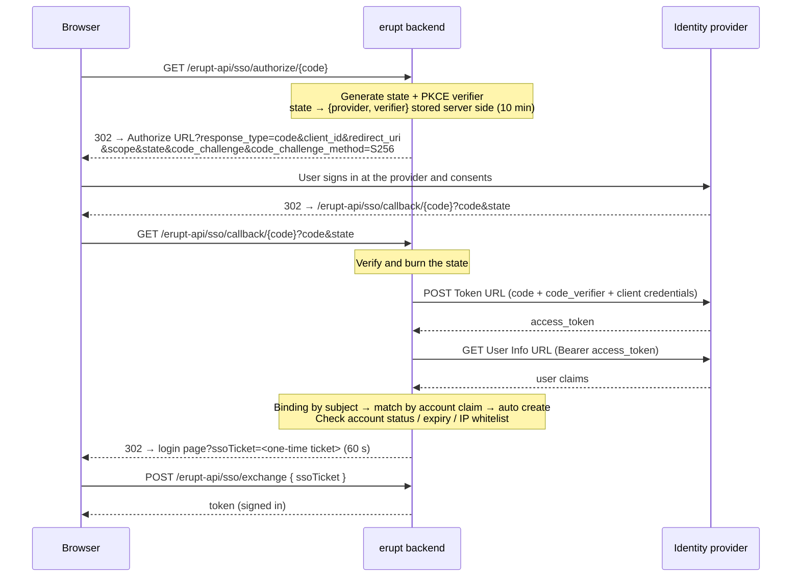

# Erupt SSO Single Sign-On

erupt-sso lets erupt delegate login to an external identity provider: OIDC services such as Keycloak, Authing and Okta, as well as platforms that only offer OAuth 2.0 such as GitHub, Gitee and Feishu. Providers are configured as rows in the admin UI under **System Management → SSO Provider** — pick a provider preset, paste the client credentials, and that is it: no code, no config file, no restart; the login page shows the button as soon as the row is saved.

> Minimum version: **2.3.0**

The module runs the OAuth 2.0 authorization code flow with PKCE enforced. The code is exchanged on the server, the resulting access token is spent on exactly one user-info call, the `id_token` is never parsed, and no JWT library is pulled in.

## Setup

```xml
<dependency>
  <groupId>xyz.erupt</groupId>
  <artifactId>erupt-sso</artifactId>
  <version>${erupt.version}</version>
</dependency>
```

`erupt-spring-boot-starter-all` already includes this module. It depends on `erupt-upms` and `erupt-data-jpa`; auto configuration adds an **SSO Provider** menu under **System Management** (plus a hidden **SSO Binding** menu, see below).

The module announces itself to the frontend through `registerProp("erupt-sso")`; the login page then fetches the provider list and renders the buttons. A system without the module keeps its login page unchanged and gains no second way in.

## How it works



Design points worth knowing:

- **The browser carries no trusted state**: `state` is only a key into a short-lived server record (provider + PKCE verifier) that is burnt on first use; a `state` issued for one provider cannot be replayed against another.
- **The token never travels in a URL**: after the callback the browser lands on the login page with nothing but a one-time ticket valid for 60 seconds, which the frontend trades for a session token via `POST /erupt-api/sso/exchange`. The token never appears in the address bar, browser history or a Referer header.
- **The return address is never taken from the request**: the callback always redirects to `erupt-app.login-page-path` (or `<host>/#/passport/login` when unset), so there is no open redirect.
- **Client authentication at the token endpoint** defaults to `client_secret_post`; HTTP Basic is used only when the OIDC discovery document says `client_secret_basic` is the only supported method.
- **Same pipeline as password login**: account status, expiry and IP whitelist checks, and the `LoginProxy` post-login hooks, apply to SSO logins too.

### Four exchange flows

The diagram shows the plain OAuth 2.0 case. What happens once the browser comes back with the `code` is decided by the row's **Provider Type**; there are four flows (`SsoProviderType.Flow`):

| Flow | Provider types | Exchange |
| --- | --- | --- |
| `OAUTH2` | Every OIDC preset, GitHub, Gitee, Feishu, Zoom, and Custom | As in the diagram: a form-encoded POST to the Token URL answered in JSON, then a bearer GET on the User Info URL |
| `DINGTALK` | DingTalk | The token request is a JSON POST, and the user token travels in DingTalk's own request header when `contact/users/me` is read |
| `WECOM` | WeCom | The corp access token (CorpID + Secret) resolves the `code` into a member userid, the profile is then read from the contact book; the sensitive fields (phone, email, avatar) unlocked by the `snsapi_privateinfo` user ticket are merged into the claims. A visitor outside the corp fails with "The account is not a member of the enterprise" |
| `WECHAT` | WeChat | Token and user info are both GETs with query parameters; the `openid` from the token response is passed on to the user-info call |

Rows created before 2.3.0 have an empty `type` column and behave as `OAUTH2`, unchanged.

## Configuring a provider


**System Management → SSO Provider**; every row is one provider. The usual order of filling it in: pick the matching preset in **Provider Type**, which fills the endpoints, scopes and claim fields; paste the Client ID / Client Secret from the provider's console; and for a self-hosted service replace the `<host>`, `<realm>`, `<agentid>` style placeholders left in the URLs, then save. Choosing **Custom** leaves every field to you and runs plain OAuth 2.0. The form has four groups:

### Basic

| Field | Description | Default |
| --- | --- | --- |
| Provider Type | 18 presets (Keycloak, Authing, Casdoor, Okta, Auth0, Microsoft Entra ID, Google, GitLab, Atlassian, Slack, Zoom, GitHub, Gitee, Feishu, DingTalk, WeCom, WeChat) plus **Custom**, see [Provider Presets](#provider-presets). Picking a preset fills in the icon, the issuer or the three URLs, the scopes, the account / name / email / phone / avatar claims and the Open ID Claim; the Code (the preset name in lower case, e.g. `keycloak`) and Name are only suggested into blank fields, never overwritten; the hints under Client ID / Client Secret switch to the provider console's own wording (Entra's "Application (client) ID", Feishu's "App ID"). Any `<placeholder>` a preset leaves in a URL must be replaced, otherwise the save is refused. The type also selects the login exchange, see [Four exchange flows](#four-exchange-flows) | Custom |
| Code | 2–32 letters, digits, `-` or `_`, unique. **Part of the callback URL**, so it cannot be edited after creation — changing it would silently break the callback registered at the provider | — |
| Name | Label of the button on the login page; i18n keys are translated | — |
| Icon | Font Awesome icon picker, shown on the button | — |
| Status | Enabled / Disabled; a disabled provider is neither listed on the login page nor accepted on callback | Enabled |
| Sort | Order of the buttons on the login page; the list supports drag sorting | — |

### Endpoint

| Field | Description | Default |
| --- | --- | --- |
| Issuer | OIDC issuer. When the three URLs below are empty they are discovered from `<issuer>/.well-known/openid-configuration`; the result is cached per issuer and evicted when the row changes or is deleted | — |
| Authorize URL | authorization endpoint | discovered from Issuer |
| Token URL | token endpoint | discovered from Issuer |
| User Info URL | userinfo endpoint | discovered from Issuer |
| Redirect URI | Where the provider sends the browser back; must match what is registered at the provider **verbatim**. When empty it is derived from the incoming request as `http(s)://<this host>/erupt-api/sso/callback/<code>`; fill it in only behind a reverse proxy or when the public domain differs from the backend's | empty, derived |

Validation on save: either all three URLs are filled in, or an Issuer is given and it serves a discovery document. An issuer without one (GitHub, Gitee and Feishu all fall in this group) is refused on save with "The issuer publishes no OpenID discovery document, fill in the Authorize, Token and User Info URLs" rather than failing at the first login. The URLs may also be filled in partially; whatever is filled overrides the discovered value.

### Client

| Field | Description | Default |
| --- | --- | --- |
| Client ID | Issued when registering the application at the provider | — |
| Client Secret | Write only: not shown in the table, masked in the form, and the stored value is kept when the mask is submitted unchanged | — |
| Messaging Key | Shown only when the Provider Type is WeCom, DingTalk or Slack; write only as well. WeCom and DingTalk take the app's **AgentId**, Slack the **Bot User OAuth Token** (`xoxb-...`). Login never reads it; it is used only when an erupt-notice [provider-backed channel](/en/modules/erupt-notice#provider-backed-channels) sends a message, so a row used for login alone may leave it empty | — |
| Scopes | Tag input **joined with spaces**; presets are the OIDC standard scopes `openid` `profile` `email` `phone` `address` `groups`, and provider-specific ones (such as GitHub's `read:user`) are simply typed in | `openid profile email` |

### User Mapping

The user info the provider returns is a JSON object; this group decides which fields are read:

| Field | Description | Default |
| --- | --- | --- |
| Account Claim | Claim matched against an erupt user's **account** on first login; when empty the Email Claim is used instead | `preferred_username` |
| Name Claim | Mapped to the user's name | `name` |
| Email Claim | Mapped to the user's email | `email` |
| Phone Claim | Mapped to the user's phone; usually `phone_number` for OIDC, `mobile` for Feishu | — |
| Avatar Claim | URL of the picture; usually `picture` for OIDC, `avatar_url` for Feishu | — |
| Open ID Claim | The claim other modules (such as notifications) use to reach this user at the provider: Feishu `open_id`, DingTalk `unionId`, WeCom `userid`, Slack `https://slack.com/user_id`. Its value is stored in the binding's Open ID column and refreshed on every login; when empty the binding carries no Open ID and push channels cannot reach the user | filled by the preset |
| Sync Profile | **Every login**: name, email, phone and avatar are overwritten from the provider each time; **Fill empty only**: only blank fields in erupt are filled, so values an administrator set by hand survive | Every login |
| Auto Create | **Create**: an unknown identity creates a user from the provider's profile; **Reject**: login fails with "No matching account in this system, please contact an administrator" plus the claim name and value, so the administrator knows what to create | Create |
| Default Roles | Role set given to a user the first time this provider creates it | — |
| Grant Roles On Login | When on, a bound user is topped up with any missing default role on every login; **roles are only ever added, never revoked**, so grants by an administrator or another provider stay | Off |
| Remark | Free text | — |

The subject (unique identifier) needs no configuration: the module tries `sub`, `id`, `openid`, `open_id`, `unionid`, `union_id`, `userId`, `user_id` in turn and takes the first non-empty value.

## Account binding and auto creation

How one SSO login lands on an erupt user:

1. **Look up the binding**: search the binding table by "provider + subject"; a hit is the user. A binding keys on the subject only and **never** falls back to email or account name afterwards — those get renamed and reused, the subject does not.
2. **First login matches by account claim**: with no binding, the value of the Account Claim (or the Email Claim when that is empty) is compared with the `account` column of the erupt user table. A match creates the binding; this happens exactly once in a binding's life.
3. **Auto create**: still no match and Auto Create is on — a user is created with the account claim as account, the name claim as name (falling back to the account), enabled, non-admin, holding the Default Roles. The user has **no usable password** (a random, irreversible hash), can only sign in through the provider, and is never nagged to change an initial password. With Auto Create off the login is rejected.
4. **Profile sync and role top-up**: name, email, phone, avatar and roles are updated according to Sync Profile and Grant Roles On Login.
5. **Usability check**: a disabled, expired or out-of-whitelist account is rejected even though the provider let it through, exactly as for password login.

:::tip Connecting existing accounts
Make the provider's account claim equal the account name in erupt: the binding is created the first time the user presses the SSO button, and renaming the account afterwards no longer matters.
:::

## Login page behaviour


While rendering, the login page calls `GET /erupt-api/sso/providers` for the enabled providers (code, name, icon — no secrets):

- Up to 3 providers share one row as buttons with icon and name
- More than 3 collapse into a row of round icon buttons with the name as tooltip
- A click navigates to `GET /erupt-api/sso/authorize/<code>`; after authentication the browser returns to the login page, which exchanges the ticket and enters the system automatically
- When the provider refuses or something fails midway, the login page shows the error (`ssoError` parameter) and the user can retry

The buttons adapt to all five login layouts (`theme.loginLayout`) and the workspace skin without extra settings.

## Provider Presets

Each of the 18 presets in **Provider Type** fills in the endpoints (an issuer for OIDC services, the three URLs otherwise), the scopes, the claim mapping and the Open ID Claim; what is left for you is the client credentials from the provider's console and the `<placeholder>` parts in a self-hosted service's URLs. The values follow each provider's documentation as of the release — when a login fails, check the row against the provider's current docs first.

| Type | Protocol | Placeholders to replace | Account Claim | Open ID Claim | Notes |
| --- | --- | --- | --- | --- | --- |
| Keycloak | OIDC discovery | `<host>`, `<realm>` | `preferred_username` | — | Issuer `https://<host>/realms/<realm>` |
| Authing | OIDC discovery | `<app>` | `preferred_username` | — | Issuer `https://<app>.authing.cn/oidc`; scopes include `phone` |
| Casdoor | OIDC discovery | `<host>` | `preferred_username` | — | Name Claim `displayName`, Phone Claim `phone` |
| Okta | OIDC discovery | `<org>` | `preferred_username` | — | Issuer points at the `oauth2/default` authorization server |
| Auth0 | OIDC discovery | `<tenant>` | `nickname` | — | — |
| Microsoft Entra ID | OIDC discovery | `<tenant-id>` | `email` | — | Credential hints "Application (client) ID" / "Client secret value" |
| Google | OIDC discovery | none | `email` | — | — |
| GitLab | OIDC discovery | none (change the issuer for a self-hosted instance) | `preferred_username` | — | Credential hints "Application ID" / "Secret" |
| Atlassian | OIDC discovery | none | `email` | `sub` | — |
| Slack | OIDC discovery | none | `email` | `https://slack.com/user_id` | Slack namespaces its claims by URL; sending messages needs the Bot User OAuth Token in Messaging Key |
| Zoom | OAuth2 | none | `email` | `id` | The token endpoint takes the client credentials as **HTTP Basic**; scope `user:read:user` |
| GitHub | OAuth2 | none | `login` | — | Scopes `read:user user:email`; a private email comes back as null and only affects profile sync |
| Gitee | OAuth2 | none | `login` | — | Scopes `user_info emails` |
| Feishu | OAuth2 | none | `user_id` | `open_id` | Enveloped user-info response, opened by the module; four `contact:user.*:readonly` scopes; Lark (international) works by changing the domain of the three URLs |
| DingTalk | DingTalk | none | `mobile` | `unionId` | Credential hints "AppKey" / "AppSecret"; for messaging the unionId is resolved to the corp userid once and cached, Messaging Key = AgentId |
| WeCom | WeCom | `<agentid>` (in the Authorize URL) | `userid` | `userid` | Client ID = CorpID, Client Secret = the self-built app's Secret; Messaging Key = the same AgentId |
| WeChat | WeChat | none | `openid` | `openid` | Website QR login, scope `snsapi_login` |
| Custom | OAuth2 | — | by hand | by hand | Leaves the form alone, plain OAuth 2.0 |

### Keycloak walkthrough

1. Choose **Keycloak** as the Provider Type; the issuer arrives as `https://<host>/realms/<realm>` — replace both placeholders, e.g. `https://sso.example.com/realms/erupt`. The three URLs come from the discovery document and stay empty.
2. Create a confidential client in Keycloak and paste its Client ID and Client Secret into the Client group.
3. In that client set **Valid redirect URIs** to `https://<erupt host>/erupt-api/sso/callback/keycloak` (`keycloak` being the Code the preset suggested).

Authing, Casdoor, Okta, Auth0, Entra ID and the other OIDC presets work the same way: replace the placeholder in the issuer, paste the credentials, register the callback.

### Feishu, WeCom and DingTalk

Besides pasting the credentials, these three need two things done in their own consoles:

- **Register the callback**: add `https://<erupt host>/erupt-api/sso/callback/<code>` to the app's redirect URLs / trusted domains.
- **Enable the scopes**: grant the app the permissions matching the scopes the preset filled in — Feishu's four `contact:user.*:readonly` scopes, WeCom's `snsapi_privateinfo` (members' sensitive fields), DingTalk's `openid` login scope.

A few more notes: WeCom needs the `<agentid>` in the Authorize URL replaced with the AgentId of the self-built app (put the same value in Messaging Key if the row will also push notifications); Feishu's user-info endpoint answers with an envelope, `{ "code": 0, "msg": "success", "data": { ... } }`, which the module opens — `data` becomes the claims and a non-zero `code` fails with "The identity provider could not be reached (code: msg)", WeCom and DingTalk envelopes being handled the same way; Lark, the international edition, only needs the domain of the three URLs changed to Lark's.

## Managing SSO bindings

The **SSO Binding** menu records "which erupt user signs in with which subject of which provider", plus the profile snapshot the provider returned at login. Bindings are created by signing in, and an administrator only needs them to investigate or unbind, so the menu is **hidden** by default (`MenuStatus.HIDE`) — switch it to visible in **Menu Management** when needed. The menu is not the only way in: on the **SSO Provider** list, the "SSO Binding" drill-down on a provider row shows only the bindings of that provider.

| Column | Description |
| --- | --- |
| Provider | The owning provider |
| User | The bound erupt user |
| Subject | The provider-side unique identifier, picked by the login flow itself (`sub` / `id` / `open_id`…), not configurable |
| Open ID | The messaging identifier mapped through the provider's Open ID Claim, refreshed on every login; push channels address the user by it |
| Last Login | When the user last signed in through this provider |
| Claims | The raw user info the provider returned at the last login (JSON, envelope removed), rewritten in full on every login. A snapshot, not a source of truth |

The menu allows viewing and deleting only. After a binding is deleted, the user's next login through that provider goes through "match by account claim → auto create" again.

### Reading bindings from other modules

`EruptSsoBindService` (a Spring bean) exposes what a binding holds to other modules. Every method reads the stored binding only and **never** calls the provider; a user who has never signed in through a provider has no binding there and gets an empty result:

| Method | Returns |
| --- | --- |
| `find(userId, providerCode)` | `Optional<EruptSsoBind>`, the user's binding with the provider (by code) |
| `findAll(userId)` | `List<EruptSsoBind>`, the bindings of every provider the user has signed in through |
| `openId(userId, providerCode)` | `Optional<String>`, the binding's Open ID |
| `claim(userId, providerCode, name)` | `Optional<String>`, any top-level field of the user-info snapshot, such as Feishu's `tenant_key` or WeCom's `department`, without a column for it; a non-primitive value comes back as its JSON text |
| `claims(userId, providerCode)` | `Optional<JsonObject>`, the whole snapshot |

```java
@Resource
private EruptSsoBindService eruptSsoBindService;

public void reachOnFeishu(Long userId) {
    // The user's open_id at Feishu; present only if they signed in through the provider whose code is "feishu"
    eruptSsoBindService.openId(userId, "feishu").ifPresent(openId -> {
        // call the Feishu API with the open_id ...
    });
}
```

A module that needs to call the provider **as the application** rather than as the user can inject `SsoProviderApi` and call `appAccessToken(EruptSso)`: it fetches an app-level token with the row's client credentials (Feishu `tenant_access_token`, DingTalk accessToken, WeCom access_token), caches it per row until shortly before expiry and drops it when the row changes; only the Feishu, DingTalk and WeCom types support it, any other type throws "This provider type has no application level API access". This is how the erupt-notice push channels send their messages.

## Endpoints

All four endpoints are reachable **without a session** — they serve users who are not signed in yet, and each carries its own proof: a state, a ticket, or nothing worth protecting:

| Endpoint | Description |
| --- | --- |
| `GET /erupt-api/sso/providers` | Enabled providers (code, name, icon) for the login page buttons |
| `GET /erupt-api/sso/authorize/{provider}` | Generates state and PKCE, then 302 to the provider's authorize URL |
| `GET /erupt-api/sso/callback/{provider}` | The provider's callback; on success 302 to the login page with `ssoTicket`, on failure with `ssoError` |
| `POST /erupt-api/sso/exchange` | Body `{ "ssoTicket": "..." }`; returns the same `LoginModel` (with token) as password login. The ticket is single-use and valid for 60 seconds; expired tickets get "Sign-in ticket expired, please sign in again" |

Common messages and what they mean:

| Message | Situation |
| --- | --- |
| Sign-in request is invalid or expired, please start again | The state is missing, expired (10 minutes), already used, or belongs to another provider |
| Provider not found or disabled | Wrong code or a disabled row |
| The issuer publishes no OpenID discovery document… | On save, the three URLs could not be discovered from the Issuer |
| Could not obtain an access token | The token endpoint returned no `access_token`, usually a client id / secret / redirect URI mismatch |
| The identity provider could not be reached (…) | The token or user-info endpoint returned non-2xx, non-JSON, or an envelope with non-zero `code`; the brackets carry the provider's own code and message |
| The provider returned no user identifier | No usable subject field in the user info; the brackets list the field names that were returned |
| The provider returned no account claim | Both the Account Claim and the Email Claim are empty |
| No matching account in this system, please contact an administrator | Auto Create is off and no account matched; the brackets show the claim name and value |
| Replace the `<placeholder>` in the URL before saving (…) | On save a URL still contains a preset placeholder such as `<host>`, `<realm>` or `<agentid>`; the brackets show that URL |
| The account is not a member of the enterprise | WeCom: the account that scanned the code is not in the corp's contact book |
| This provider type has no application level API access | `SsoProviderApi.appAccessToken` was called on a row whose type is not Feishu / DingTalk / WeCom |

## Database tables

| Table | Description |
| --- | --- |
| `e_upms_sso` | Providers, extends `MetaModelUpdateVo`; columns mirror the form: `type` VARCHAR(32) (the Provider Type enum name; empty on rows created before 2.3.0, treated as Custom), `code` (unique), `name`, `icon`, `status`, `sort`, `issuer`, `authorize_url`, `token_url`, `user_info_url`, `redirect_uri` (all VARCHAR(512)), `client_id`, `client_secret` VARCHAR(512), `messaging_key` VARCHAR(255), `scopes` VARCHAR(255), `account_claim` / `name_claim` / `email_claim` / `phone_claim` / `avatar_claim` / `open_id_claim` VARCHAR(64), `sync_profile`, `auto_create`, `grant_roles_on_login`, `remark` |
| `e_upms_sso_role` | Default roles of a provider, `sso_id` + `role_id` |
| `e_upms_sso_bind` | Bindings, extends `MetaModelUpdateVo`: `sso_id`, `erupt_user_id`, `subject` VARCHAR(255) NOT NULL, `open_id` VARCHAR(255), `last_login_time` DATETIME(6), `claims` VARCHAR(10485760) (`AnnotationConst.CONFIG_LENGTH`, mapped to LONGTEXT on MySQL); unique constraint `(sso_id, subject)` |

Projects with JPA schema generation enabled get the tables on upgrade; projects that maintain their schema by hand should create them from the table above.

:::tip Relation to the Spring Security OAuth2 approach
Before 2.3.0 the documented approach was to add `spring-boot-starter-oauth2-client`, configure the provider in `application.yml` and write your own callback controller that exchanges the identity for an erupt token — see [Login & Authentication → Advanced: Spring Security OAuth2 Client](/en/advanced/auth#advanced-spring-security-oauth2-client). It still works and suits deep customisation of the authorization flow; for ordinary integrations erupt-sso is recommended: configure it in the admin UI, with no code and no restart.
:::
