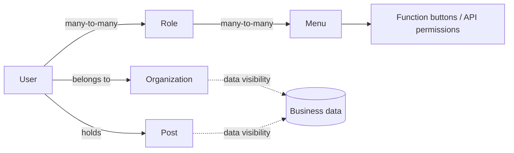

# Erupt UPMS Permission Management

erupt-upms is Erupt's User Permission Management System: users, roles, menus, organizations, posts, dictionaries, Open API, online users and three kinds of logs. Every screen is generated from `@Erupt` annotations, with no UI code to write.

It covers the part every back office needs and nobody should rebuild: **who may log in, which menus they see afterwards, which buttons they may press inside those menus, which data they may see, and how to trace it all later.**

## Adding the Dependency

`erupt-upms` is bundled inside `erupt-admin`, so nothing extra is needed:

```xml
<dependency>
  <groupId>xyz.erupt</groupId>
  <artifactId>erupt-admin</artifactId>
  <version>${erupt.version}</version>
</dependency>
```

Log in with the default account after startup (change it via `erupt.upms.default-account` / `default-password`, see [Configuration](/en/guide/configuration)):

| Account | Password |
| --- | --- |
| erupt | erupt |

## Permission Model



- A **menu** is the smallest unit of permission. Each Erupt class maps to one menu, and its add / edit / delete / export buttons are generated as child menus, so ticking one grants it.
- A **role** is a set of menus. A user may hold several roles and the permissions are merged as a union.
- **Organizations and posts** do not take part in menu authorization. They define **data visibility**: once a business entity extends `LookerOrg` / `LookerPostLevel` / `LookerSelf`, non-admins only see rows from their own organization, from lower posts in that organization, or that they created themselves.
- A **super admin** (the "Admin User" switch on a user) bypasses every menu and data filter.

## Feature Guide

The menus created under "System Management" at startup, each with its own page:

| Page | What it solves |
|---|---|
| [Menu Management](/en/modules/erupt-upms/menu) | Which pages, buttons and APIs exist, and how each one opens |
| [Role Management](/en/modules/erupt-upms/role) | Bundle menus into job duties, and stop operators from granting more than they hold |
| [Organizations & Posts](/en/modules/erupt-upms/org-post) | The org tree and post ranks, and the data scopes built on them |
| [User Management](/en/modules/erupt-upms/user) | Account lifecycle: password policy, locking, expiry, IP whitelist, password reset |
| [Data Dictionary](/en/modules/erupt-upms/dict) | Turn enums scattered through code into key-values maintained online |
| [Open API](/en/modules/erupt-upms/open-api) | Issue an APPID + Secret so an external system can call APIs as a given user |
| [Online Users](/en/modules/erupt-upms/online) | Who is signed in right now, from where, and force them out in one click |
| [Login & Operation Logs](/en/modules/erupt-upms/log) | Who did what, when, from where, with what data before the change, how long it took, and whether it failed |
| [System Log](/en/modules/erupt-upms/system-log) | Read live application logs in the browser without a server login |

## Related Extension Points

Code-level extensions of the permission system live in the Advanced section:

| Need | Page |
|---|---|
| Custom login logic (LDAP / SSO / SMS codes) | [Login & Authentication with LoginProxy](/en/advanced/auth) |
| Replace the login page | [Custom Login Page](/en/advanced/custom-login-page) |
| Require login or a menu permission on your own API | [REST API permissions](/en/advanced/rest-api) |
| Filter data by organization / post / creator | [PreDataProxy and Lookers](/en/advanced/pre-data-proxy) |
| Use a dictionary as dropdown options | [CHOICE → Dictionary options](/en/field-types/choice#dictionary-options) |
| Watermark, captcha threshold, session length | [Configuration](/en/guide/configuration) |
