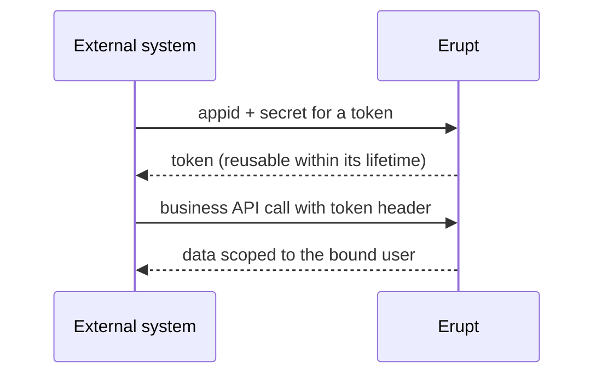

# Open API

Open API issues credentials to **external systems**. The caller exchanges APPID + Secret for an erupt token, then calls protected erupt APIs, including CRUD on any Erupt class, **with the permissions of the bound user**.

Compared with sharing someone's account and password, a credential can be revoked at any time, carries its own token lifetime, shows the full secret only once at creation, and gives every integrator its own auditable record.

## Fields

| Field | Description |
| --- | --- |
| APPID | Generated: `es` prefix + 14 random characters |
| Name | Identifies the integrator, e.g. "ERP Sync" |
| Token Validity Period | Minutes, default 3600 |
| Bind User Permissions | API calls run with this user's menu permissions and data scope. Create a least-privilege user per integrator |
| Status | Disabling immediately invalidates any issued token |
| Secret Key | Generated 24-character uppercase string. The list shows only the first and last 4 characters, the rest masked with `*` |

## Secret Management

- The **Update Secret Key** row operation generates a new secret, shows it once in a popup, and invalidates the old one immediately.
- Disabling or deleting a record also logs out its issued token.

## Call Flow

Endpoints, parameters and sample code: [Open API →](/en/advanced/open-api)
