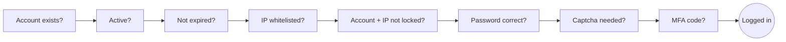

# User Management

Manages every account that can log in. The left panel is the organization tree, the right panel the user list. Select an organization to filter.

## Fields

The form is grouped into **Basic Info, Role, Organization, Password and Security**. Organization / Password / Security are collapsible panels, and Security is collapsed by default (the step-by-step form was dropped in 2.3.0):

| Option | Description |
| --- | --- |
| Avatar | Shown as a round thumbnail in the table; not editable in the admin form, users set it themselves through [Profile](#profile-and-lock-screen) in the avatar menu |
| Account | Login name, fixed after creation |
| Full Name / Phone / Email | Profile data; email is format-checked |
| Account Status | Active allows login; Locked rejects it with a message |
| Admin User | A super admin bypasses all menu permissions and data scopes. **Only a super admin can make someone an admin** |
| Home Menu | Menu opened after login; the system home is used when empty |
| Role | Multi-select, menu permissions merge as a union |
| Org / Post | Drive [data visibility](/en/modules/erupt-upms/org-post#data-visibility); an org must be set before a post |
| Responsible Org / Supervising Org | Multi-select, used by erupt-flow to find approvers |
| Password / Confirm Password | Required on add; leave empty on edit to keep the current one |
| Encrypt | Stores the password as a **salted SHA-512 hash**, irreversible. On by default, not recommended to disable |
| Account Expiry | Login is refused after this date, good for contractors and temporary accounts |
| MFA | Table column only, searchable, never editable in the form: granted when the user enrols an authenticator, revoked by the **Reset MFA** row operation, see [Two-Factor Authentication](#two-factor-authentication-mfa) |
| IP Whitelist | One entry per line, checked at login; empty means no check. Accepts single IPv4 / IPv6 addresses as well as CIDR blocks (e.g. `10.0.0.0/8`, `2001:db8::/32`) |

## Login Checks

A login request passes through these checks in order, and stops at the first failure with its reason:



- After `erupt-app.verify-code-count` consecutive failures (default 2) for the same account + IP, the login page shows a captcha.
- After `erupt.upms.login-lock.max-failures` consecutive failures (default 10) for the same account + IP, that pair is locked for `lock-minutes` (default 10). A wrong captcha counts as a failure too, and a locked pair is refused before the captcha is even checked. Set `erupt.upms.login-lock.enable=false` to turn it off, see [Login Lock](#login-lock).
- When the password is right but the account has MFA enabled, `/erupt-api/login` issues no session: it returns a ticket valid for 5 minutes, and the session is created only after `/erupt-api/login-mfa` accepts the ticket together with a 6-digit code.
- Passwords are encrypted in transit by default (`erupt-app.pwd-transfer-encrypt`) and stored as salted SHA-512.
- A successful login is written to the [login log](/en/modules/erupt-upms/log#login-log). Session length is `erupt.upms.expire-time-by-login`.
- All of these are described in [Configuration](/en/guide/configuration). To plug in LDAP / SSO / SMS, implement `LoginProxy` and take over any step, see [Login & Authentication](/en/advanced/auth). Account status, expiry and IP whitelist are enforced for every login path alike (password, SSO, LoginProxy).

## Two-Factor Authentication (MFA) <Badge type="tip" text="v2.3.0+" />

Built on TOTP (RFC 6238), so any authenticator app works: Google Authenticator, Microsoft Authenticator, 1Password and so on. The feature is open for the whole deployment by default (`erupt-app.mfa.enable`, default `true`) but forces nobody to enrol, so existing users are unaffected by the upgrade.

**Enrolling**: avatar menu in the top right → **Two-factor auth**, then follow the three-step dialog:


1. **Scan**: scan the QR code with the authenticator (rendered in the browser from the `otpauth://` URI, so no image of the secret travels through the server); without a camera, type the text secret shown beside it.
2. **Verify**: enter the 6-digit code the authenticator currently shows to prove the binding works. The secret reaches the database only after this step passes, so an abandoned dialog leaves no half-configured account behind.
3. **Save recovery codes**: 10 recovery codes are generated and shown exactly once; the dialog can only be closed after they were copied or downloaded.

**How login changes**: once the password is accepted, the login card swaps its body for a single code input that submits itself after 6 digits. Either an authenticator code or a recovery code is accepted. Five wrong codes burn the ticket and the user has to start again from the password.

**Recovery codes**: single-use, stored as SHA-256 hashes on the server. A fresh set can be generated from the two-factor dialog (a current code is required). Removing the binding requires both the password and a current code.

**Admin operation**: when a user loses the authenticator, an admin runs the **Reset MFA** row operation in the user list (enabled only for users with MFA on). The binding is cleared, the next login needs only the password, and the user can enrol again. The secret is never shown to the admin, only destroyed.

:::info
The MFA check sits where every login branch meets, so a login through a custom `LoginProxy` requires the second factor as well. Endpoint details are in [Login & Authentication → Second Step for Two-Factor Accounts](/en/advanced/auth#second-step-for-two-factor-accounts).
:::

## Login Lock <Badge type="tip" text="v2.3.0+" />

Once the same account fails repeatedly from the same IP, that "account + IP" pair is locked for a while and every attempt, right or wrong, is answered with the lock message. The key is account + IP rather than the account alone so that an attacker hammering the account from elsewhere cannot lock the user out of their own machine.

```yaml
erupt:
  upms:
    login-lock:
      enable: true        # off: the captcha stays the only brute-force defence
      max-failures: 10    # consecutive failures for one account + IP
      lock-minutes: 10    # lock duration in minutes; the counter restarts once it lifts
```

A wrong captcha counts like a wrong password, and the password check behind the lock screen goes through the same chain.

## Profile and Lock Screen <Badge type="tip" text="v2.3.0+" />

**Profile**: avatar menu → **Profile** lets a user change their own avatar and display name; the header updates in place after saving. The endpoint is `POST /erupt-api/profile` (uploads go to `/erupt-api/profile/avatar`; both only need a signed-in session, not the user-management menu). An avatar must be an uploaded path or an absolute `http(s)` URL, in jpg / jpeg / png / gif / webp, at most 2 MB. To review or veto a change, throw from `LoginProxy.beforeUpdateProfile(EruptUser, ProfileBody)`, see [Login & Authentication](/en/advanced/auth). The entry is shown to platform accounts only, never to tenant sessions.

**Lock screen**: **Lock screen** in the avatar menu covers the window while the page stays mounted, and survives a refresh. Unlocking takes the account's password via `POST /erupt-api/verify-pwd`, which reuses the sign-in check (failure counter, login lock and `LoginProxy` included) without issuing a new session. The entry is hidden for tenant sessions.

## Password Reset

The **Reset Password** row operation lets an admin set a new password directly. Users change their own password from the avatar menu in the top right; disable it with `erupt-app.reset-pwd`. With `erupt-app.reset-pwd-prompt` on, users still on the initial password are reminded at every login.

Since 2.3.0, changing a password, whether by the user or through Reset Password, **signs out every other session of that account**; only the session that made the change stays, so whoever held the old password loses access at once.

## Recommendations

- Change the default `erupt / erupt` password right after the first production start, or set `erupt.upms.default-account` / `default-password` up front.
- Enrol every admin account in MFA; give ops and integration accounts an IP whitelist and an expiry date.
- Keep admin accounts to a minimum and do daily work with ordinary roles so the [operation log](/en/modules/erupt-upms/log) stays attributable.
