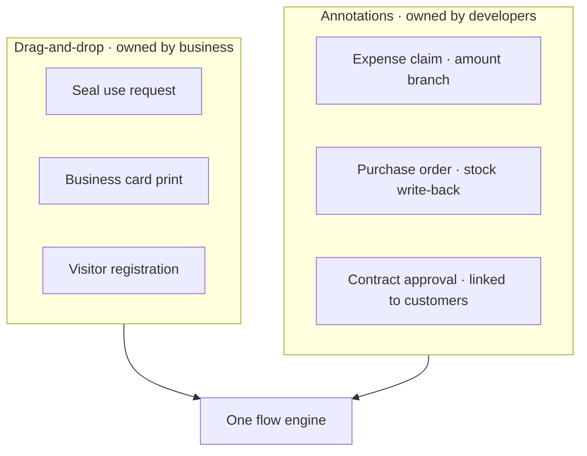

# Approval Forms

An erupt-flow approval form is just an Erupt model. There are two ways to define one: **drag-and-drop design** and **annotation modeling**. Both produce a standard Erupt model and both appear side by side in the flow configuration screen. Which one you pick depends on how complex the form is, not on your tech stack.

| | Drag-and-drop | Annotations |
|---|---|---|
| Who builds it | Business or implementation staff | Developers |
| Where | The form designer in the browser | Java source |
| How it goes live | Publish, no restart | Compile and deploy |
| Where data lives | Embedded SQLite file | The project's main database |
| Best for | Flat forms with simple rules | Field interaction, validation, callbacks, links to business tables |

Both can coexist in one system: routine leave, seal-use and expense forms are dragged together by business staff, while forms that compute amounts, check stock or write back business status are written by developers.

## Option 1: Drag-and-Drop Design

Add [erupt-designer](/en/modules/erupt-designer) and it works, with no extra flow configuration.

```xml
<dependency>
    <groupId>xyz.erupt</groupId>
    <artifactId>erupt-designer</artifactId>
    <version>${erupt.version}</version>
</dependency>
```


Steps:

1. Open the **Form Designer** menu, create a record, fill in the class name and name.
2. Press the **Design** row button, then drag in text, number, date, dropdown and attachment fields and set their properties.
3. Press **Preview** to check it, then publish.
4. Create a flow in the flow configuration, and the model is selectable in the **bound form** dropdown.

:::tip Nothing to declare by hand
When erupt-designer and erupt-flow are both present, the runtime class the designer generates carries the `@EruptFlow` marker automatically (v2.2.0+). **Every published design is flow-capable**, with no "enable workflow" switch to tick in the designer.
:::

Business data for designed models lives in an embedded SQLite file (`data/designer.db` by default), decoupled from the main database. Mount that file on a persistent volume when deploying, see [erupt-designer → Data Storage](/en/modules/erupt-designer#data-storage).

### Limits

Three things are out of reach with drag-and-drop. Switch to annotations when you need them:

| Limit | Why |
|---|---|
| Conditional branches cannot read form fields | A gateway condition is decided by running a database query against the form model, and designed data does not live in the main database. For "amount > 5000 goes to the GM", use an annotated model |
| No flow callbacks | `FlowProxy` is bound through `@EruptFlow(flowProxy = ...)`, which a designed model cannot set, so `onNodeStart` / `onNodeEnd` / `onReject` never fire |
| No foreign keys to business tables | A designed model is not a JPA entity. Reference fields keep a JSON snapshot, so they cannot join business tables for reporting |

Everything else is unaffected: launching, approving, CC, adding approvers, rejection, notifications, [flow printing](/en/modules/pro/erupt-flow/print), and `${form.field}` expressions inside Flex automation nodes all work as usual.

## Option 2: Annotation Modeling

Add `@EruptFlow` to any Erupt class and it appears in the form dropdown of the flow configuration:

```java
@EruptFlow
@Erupt(name = "Leave Request")
@Table(name = "biz_leave")
@Entity
@Getter
@Setter
public class Leave extends BaseModel {

    @EruptField(
        views = @View(title = "Leave Type"),
        edit = @Edit(title = "Leave Type", type = EditType.CHOICE, notNull = true,
                     choiceType = @ChoiceType(vl = {
                         @VL(value = "1", label = "Annual"),
                         @VL(value = "2", label = "Personal"),
                         @VL(value = "3", label = "Sick")
                     }))
    )
    private String type;

    @EruptField(
        views = @View(title = "Days"),
        edit = @Edit(title = "Days", type = EditType.NUMBER, notNull = true)
    )
    private Double days;
}
```


What annotations add on top:

- **Conditional branches**: a gateway can test `days` or `type` directly to pick an approval path.
- **Flow callbacks**: bind one with `@EruptFlow(flowProxy = LeaveFlowProxy.class)` to write business status, send notices or call external APIs when a node starts, ends or is rejected. See [Workflow Development → Flow callbacks](/en/modules/pro/erupt-flow/development#flow-callbacks-flowproxy).
- **The full field toolbox**: field interaction (`trigger`), `DataProxy` validation, and every `@EruptField` component and expression, exactly as on any other Erupt model.
- **Native relationships**: the table sits in the main database, so it joins other business tables for reporting and raw SQL.

## Mixing the Two

A common split inside one system:



The test is simple: **if approval just files the form away, drag it; if approval has to trigger something else in the system, or the path depends on what was filled in, write the annotations.**

## Migrating from Designer to Annotations

Once a designed form grows branches or callbacks, it converts cleanly:

1. Press **Export Code** in the designer to generate standard annotated Java.
2. Drop the code into the project under a **different class name**, then add `@Entity`, `@Table` and `@EruptFlow`.
3. Deploy, then point the flow's bound form at the new model.

:::warning Existing records do not move
Designed data is in SQLite, annotated data is in the main database, and switching the bound form migrates nothing. Instances already launched still point at the original model, so keep the old design rather than deleting it, or export and re-import the data by hand.
:::
