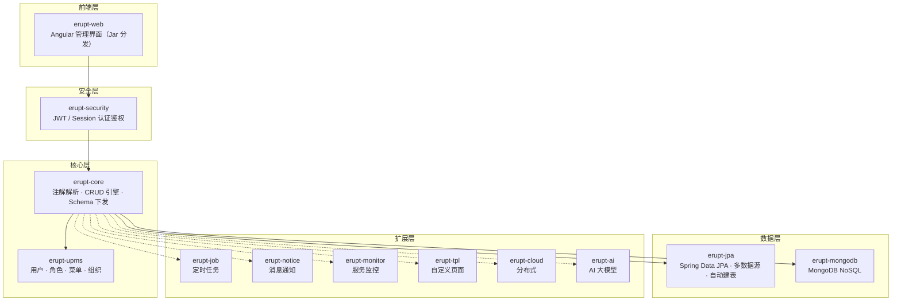
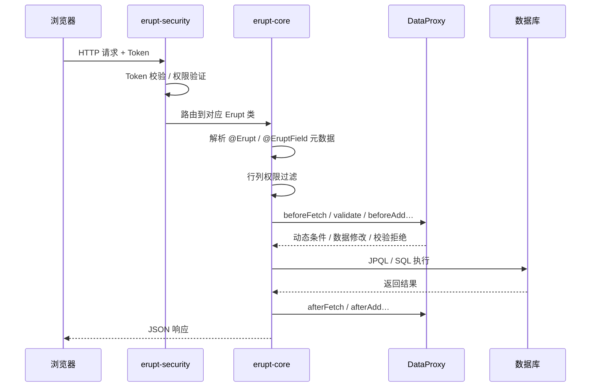
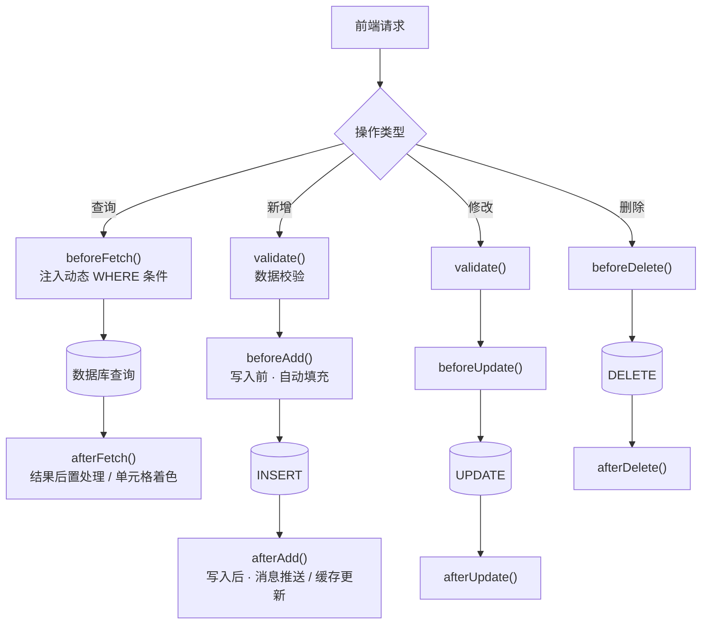
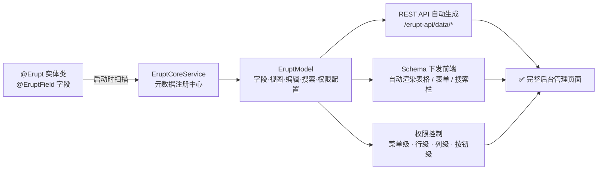
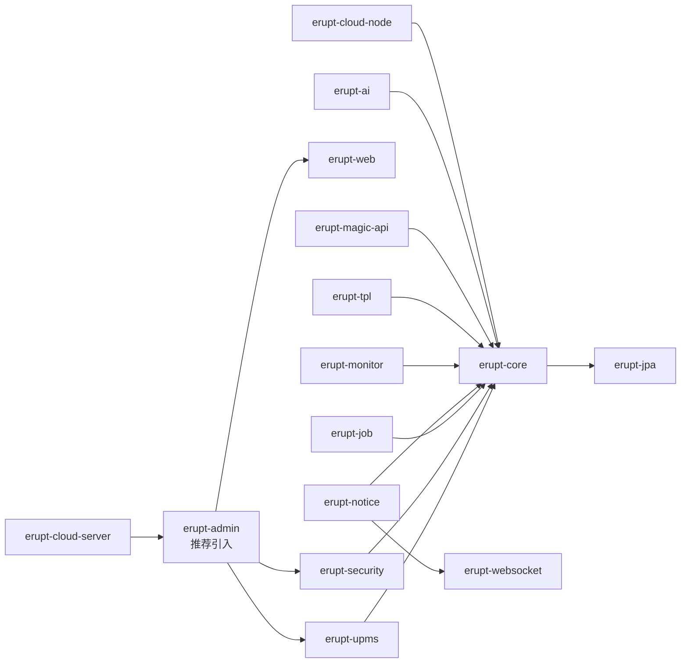
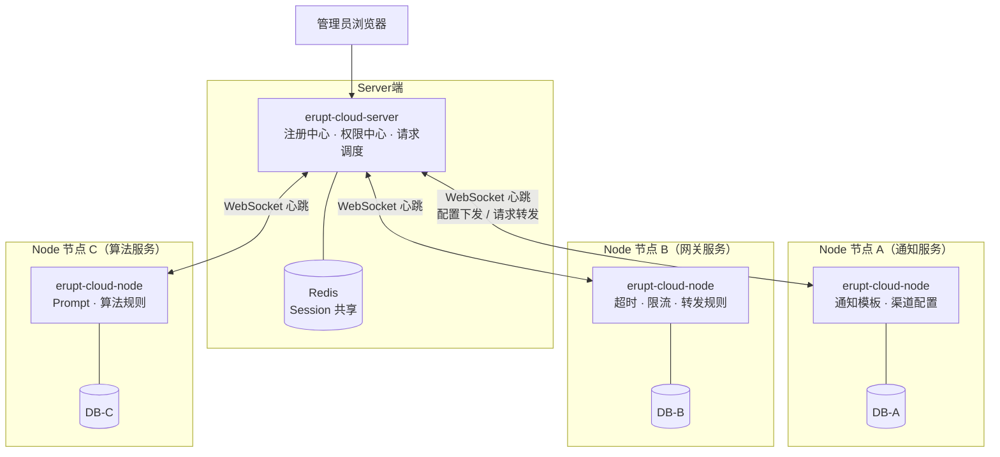

# 架构图

## 功能导图

## 功能架构

---

## 分层架构

Erupt 采用分层模块化设计，各层职责清晰，按需引入。

## 请求生命周期

一次 CRUD 请求在框架内的完整处理流程：

## DataProxy 生命周期

DataProxy 是 Erupt 的 Service 层，覆盖增删改查全部生命周期钩子：

## 注解驱动原理

从一个 Java 类到完整后台管理页面的自动化过程：

## 模块依赖关系

## 分布式架构（erupt-cloud）

