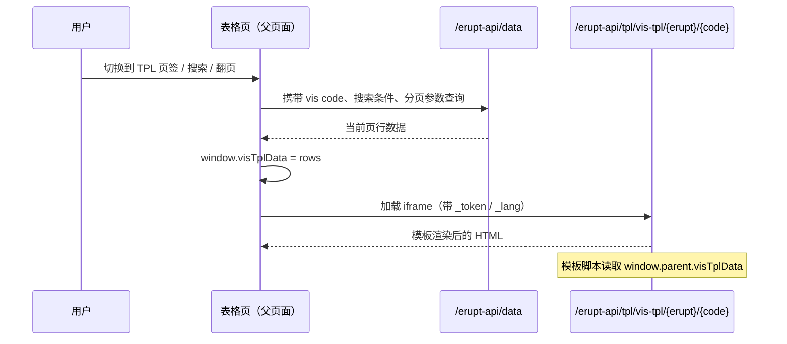

# 自定义视图 TPL

当内置的表格、卡片、甘特图、看板、日历都不满足需求时，可以用 `@Vis(type = Vis.Type.TPL)` 挂载一个**完全由自己编写的页面**作为视图页签：后端用模板引擎渲染 HTML，前端以 iframe 整页内嵌，并把当前查询结果同步给模板，让自定义页面与表格共享同一套搜索、过滤与分页。

:::tip
使用前需引入 [erupt-tpl](/zh/modules/erupt-tpl/) 模块，否则模板引擎不会被注册。`@Tpl` 的完整属性说明见 [@Tpl 自定义模板](/zh/annotation/tpl)。
:::

## 完整示例

```java
@Entity
@Table(name = "t_order")
@Erupt(
    name = "订单",
    visRawTable = true,
    vis = {
        @Vis(
            code = "chart",                              // 必填，用于定位模板渲染接口
            title = "销售趋势",
            type = Vis.Type.TPL,
            tplView = @Tpl(path = "/tpl/order-chart.ftl", height = "600px"),
            filter = @Filter("status = 'PAID'")           // 视图独立过滤，同样作用于模板拿到的数据
        )
    }
)
public class Order extends BaseModel {

    @EruptField(
        views = @View(title = "订单号"),
        edit = @Edit(title = "订单号", notNull = true)
    )
    private String orderNo;

    @EruptField(
        views = @View(title = "金额"),
        edit = @Edit(title = "金额", notNull = true)
    )
    private BigDecimal amount;

    @EruptField(
        views = @View(title = "状态"),
        edit = @Edit(title = "状态", type = EditType.CHOICE,
            choiceType = @ChoiceType(vl = {@VL(value = "PAID", label = "已支付"), @VL(value = "PENDING", label = "待支付")}))
    )
    private String status;

    @EruptField(
        views = @View(title = "下单时间"),
        edit = @Edit(title = "下单时间", search = @Search(vague = true))
    )
    private Date createTime;
}
```

模板 `src/main/resources/tpl/order-chart.ftl`：

```html
<!DOCTYPE html>
<html>
<head>
    <meta charset="UTF-8">
    <script src="${base}/tpl/js/echarts.min.js"></script>
</head>
<body style="margin:0">
<div id="chart" style="width:100%;height:100vh"></div>
<script>
    // 父页面把当前页查询结果放在 window.parent.visTplData
    const rows = window.parent.visTplData || [];
    const chart = echarts.init(document.getElementById('chart'));
    chart.setOption({
        xAxis: {type: 'category', data: rows.map(r => r.orderNo)},
        yAxis: {type: 'value'},
        series: [{type: 'bar', data: rows.map(r => r.amount)}]
    });
</script>
</body>
</html>
```

## 工作机制



1. **数据查询**：切换到 TPL 页签、搜索、翻页、排序都会触发一次表格数据查询，请求体带上当前 `@Vis` 的 `code`，因此 `@Vis` 上的 `filter` / `orderBy` 以及页面上方的搜索条件都会生效。
2. **数据注入**：查询完成后，前端把当前页的行数据写入父窗口的 `window.visTplData`，随后才渲染 iframe，模板脚本通过 `window.parent.visTplData` 即可读取。
3. **模板渲染**：iframe 指向 `/erupt-api/tpl/vis-tpl/{erupt}/{code}`，服务端按 `tplView` 指定的引擎渲染模板。接口会校验当前用户对该实体的权限，以及 `@Vis.show` 表达式，不满足时返回无权限。
4. **刷新时机**：每次查询开始时 `visTplData` 会被清空并显示加载中，查询完成后 iframe **重新加载**。模板不需要监听数据变化，只需在页面加载时读取一次数据即可。

## 关键约束

| 项目 | 说明 |
|---|---|
| `code` | **必填**。渲染接口通过 `code` 定位视图，为空时无法加载 |
| `height` | 视图容器高度，需带单位；缺省时随浏览器窗口高度自适应 |
| 生效的 `@Tpl` 属性 | `path` / `engine` / `tplHandler` / `params` / `height`；`width` / `openWay` / `embedType` / `drawerPlacement` / `enable` 在此位置不生效 |
| 模板内置变量 | `request`、`response`、`base`（应用上下文路径），以及 `path` 尾部 `?k=v` 追加的变量 |
| 行数据 | 只包含**当前页**，结构与表格接口一致；引用字段以 `字段名_属性名` 形式平铺，如 `dept_name` |
| 分页 | TPL 视图下分页条仍然显示，可通过调整每页条数控制模板拿到的数据量 |

:::warning 数据只有当前页
`visTplData` 是分页后的结果，不是全表数据。若图表需要全量统计，请将每页条数调大，或在 [TplHandler](#服务端预处理-tplhandler) 中自行查询后注入模板。
:::

## 服务端预处理 TplHandler

需要在服务端聚合数据（例如统计全量而非当前页）时，通过 `tplHandler` 向模板注入变量：

```java
@Vis(
    code = "summary", title = "汇总",
    type = Vis.Type.TPL,
    tplView = @Tpl(path = "/tpl/order-summary.ftl",
                   tplHandler = OrderSummaryHandler.class,
                   params = {"PAID"})
)
```

```java
@Component
public class OrderSummaryHandler implements Tpl.TplHandler {

    @Resource
    private EruptDao eruptDao;

    @Override
    public void bindTplData(Map<String, Object> binding, String[] params) {
        binding.put("total", eruptDao.lambdaQuery(Order.class)
                .eq(Order::getStatus, params[0])
                .count());
    }
}
```

模板中直接使用 `${total}`。`tplHandler` 在 `engine = Native` 模式下不可用。

## 与其他视图的组合

TPL 视图与其他 `@Vis` 类型可以并列使用，各页签独立配置 `filter` / `orderBy` / `show`：

```java
@Erupt(
    name = "订单",
    visRawTable = true,
    vis = {
        @Vis(title = "看板", type = Vis.Type.BOARD, boardView = @BoardView(groupField = "status")),
        @Vis(code = "chart", title = "趋势图", type = Vis.Type.TPL,
             tplView = @Tpl(path = "/tpl/order-chart.ftl"),
             show = @ExprBool(exprHandler = AdminOnlyHandler.class))
    }
)
```

`show` 为 `false` 时页签不显示，同时服务端渲染接口也会拒绝请求，无法通过直接访问 URL 绕过。
