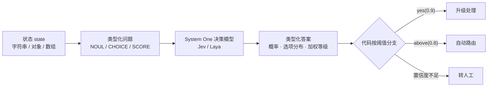

# Erupt AI Decision 决策模型 <Badge type="tip" text="v2.3.0+" />

erupt-ai-decision 为业务代码提供**可直接分支的 AI 判断**。它不让大模型写一段话再由你去解析，而是向 System One 决策模型提出**类型化的问题**，
拿回带概率分布的类型化答案：是/否的概率、封闭选项中的赢家、有序等级上的加权位置。代码按阈值分支，无需正则、无需解析 JSON、无需提示词工程。

:::info 仓库地址
[https://github.com/erupts/erupt/tree/master/erupt-ai/erupt-ai-decision](https://github.com/erupts/erupt/tree/master/erupt-ai/erupt-ai-decision)
:::

## 引入方式

1. 添加依赖（仅依赖 erupt-data-jpa，**不需要** erupt-ai，也不读取 upms）：

```xml
<dependency>
    <groupId>xyz.erupt</groupId>
    <artifactId>erupt-ai-decision</artifactId>
    <version>${erupt.version}</version>
</dependency>
```

`erupt-spring-boot-starter-all` 已包含本模块。

2. 启动后新增 **AI 决策** 菜单组，下含 **决策** 与 **决策模型** 两个菜单。

## 它解决什么问题

让大模型判断一张工单"是否紧急"时，常规做法是写提示词、拿回一句话、再用字符串匹配或 JSON 解析去猜它的意思。
结果不稳定、无法量化、每次改提示词都可能让解析失效。

决策模型换了一种方式：**问题本身带类型，答案是概率分布**。你问"这是否紧急？"，拿回的是 `0.93` 而不是"是的，我认为这很紧急"；
你问"该归哪个团队？"，拿回的是 `BILLING` 以及每个选项的概率。阈值放在代码里，模型只负责判断。



三种基本问题类型（`PrimitiveType`）：

| 类型 | 问什么 | 答什么 | 典型用法 |
|---|---|---|---|
| **NOUL** | 是 / 否 | "是"的概率（0~1） | `yes(0.9)`：概率高于阈值才视为是 |
| **CHOICE** | 从封闭选项集中选一个 | 赢家 + 全部选项的概率分布 | `above(0.8)`：置信度足够才路由，否则转人工 |
| **SCORE** | 在有序等级上处于哪个位置 | 概率加权的位置，可落在两级之间（如 `1.05`） | 情绪 / 风险 / 优先级打分 |

:::tip
NOUL 的答案本身就是概率，不额外报置信度；CHOICE 与 SCORE 的答案携带 0~1 的置信度，用来决定"要不要采纳这个判断"。
:::

## 配置决策模型

进入 **AI 决策 → 决策模型**，新建一条模型连接。选择服务商后，表单会自动填入该服务商的默认 API 域名与模型名。

| 服务商 | 说明 | 默认 API 域名 | 默认模型 |
|---|---|---|---|
| **TypeSafe Jev** | TypeSafe 托管的 System One 模型，按量计费，需要 API Key；CHOICE 最多 255 个选项 | `https://api.typesafe.ai` | `jev-latest` |
| **Laya** | Convai Innovations 的 Apache 2.0 开源模型，本地部署，见下文 [本地部署 Laya](#本地部署-laya) | `http://127.0.0.1:8000` | `auto` |

| 字段 | 说明 |
|---|---|
| **名称** | 模型连接名称，`using("名称")` 与 HTTP 接口的 `?model=` 参数都以此寻址 |
| **服务商** | TypeSafe Jev / Laya |
| **模型** | Jev：`jev-latest` 等别名或固定版本；Laya：`auto` / `english` / `multilingual` / `typed-decisions` |
| **API 域名** | 服务商地址；请求实际发往 `{API 域名}/v1/systemone` |
| **API Key** | Jev 必填；Laya 留空，除非 sidecar 启动时设置了 `LAYA_API_KEY` |
| **超时时间（秒）** | 单次请求超时，默认 15，范围 1~120 |
| **最大重试次数** | 服务商返回限流（429）或过载（529）时按退避重试，默认 2，范围 0~5；优先遵循服务商的 `retry-after` |
| **状态** | 激活 / 锁定 |
| **默认决策模型** | 只读列；通过行操作「默认决策模型」切换 |
| **排序** | 拖拽排序 |

**默认模型规则：**

- 新建的第一条模型自动成为默认模型；之后通过行操作 **默认决策模型** 切换，同一时刻只有一条默认。
- 运行时的模型解析顺序：**显式指定的模型 → 决策自带的模型 → 默认模型**。
- 若默认模型被锁定或删除，运行时回退到任意一条已激活的模型；没有任何激活模型时报错 `No decision model is configured`。
- 通过名称指定的模型必须处于激活状态，否则报错 `No such decision model`，不会悄悄改用默认模型。

**连接测试**：表单中的 **连接测试** 按钮会向服务商发一个最便宜的 NOUL 问题（"这句话是英文吗？"），弹窗显示实际应答的模型版本与概率，用于验证地址与 Key。

## Java API

问题是不可变的值对象，声明为常量即可到处复用；模型在调用之间不保存状态。

```java
import xyz.erupt.decision.Decisions;
import xyz.erupt.decision.Decision;
import xyz.erupt.decision.question.Noul;
import xyz.erupt.decision.question.Choice;
import xyz.erupt.decision.question.Score;

// 声明一次，到处复用
static final Noul URGENT = Noul.of("Does this convey urgency?");
static final Choice<Dept> DEPT = Choice.of("Which team should handle this?", Dept.class);
static final Score MOOD = Score.of("How frustrated is the customer?", "Calm", "Frustrated", "Very angry");

// 一个问题，一行代码
if (Decisions.of(ticket).ask(URGENT).yes(0.9)) escalate(ticket);

// 多个问题一次问完：状态只读一次，一次计费，一次往返
Decision d = Decisions.of(ticket).ask(URGENT, DEPT, MOOD);
d.get(DEPT).above(0.8).ifPresentOrElse(this::route, () -> queueForHuman(ticket));

// 运行后台定义的决策，按编码寻址
Decision stored = Decisions.of(ticket).run("ticket_triage");
boolean refund = stored.noul("refund_requested").yes();

// 固定使用某一条决策模型
Decisions.of(ticket).using("模型名称").ask(URGENT);
```

`Decisions.of(state)` 接受字符串、对象或数组：对象会以结构化 JSON 交给模型，比拼接字符串更准确。

**问题构造方法：**

| 方法 | 说明 |
|---|---|
| `Noul.of(instructions)` | 是/否问题 |
| `Noul.criteria(yesMeans, noMeans)` | 可选：说明"是"与"否"各代表什么 |
| `Choice.of(instructions, EnumClass.class)` | 选项取自枚举，答案就是枚举常量，不会以裸字符串流入业务代码 |
| `Choice.of(instructions, Map<String, ?> criteria)` | 选项内联，每个选项附带"何时适用"的判断标准 |
| `Choice.of(instructions, String... options)` | 只用选项名，不附带说明 |
| `Score.of(instructions, level1, level2, ...)` | 有序等级，最低的在前，2~10 个 |

`instructions` 与各项判断标准都接受字符串、对象或数组。

**`Criteria` 接口**：作为 CHOICE 选项的枚举可以实现 `xyz.erupt.decision.question.Criteria`，让每个常量自己描述适用规则。模型读的是描述而不是常量名，描述过的枚举判断准确得多：

```java
enum Dept implements Criteria {
    BILLING("Invoices, refunds, payment failures"),
    TECH("Bugs, errors, integration problems"),
    SALES("Pricing, upgrades, new licenses");

    private final String criteria;
    Dept(String criteria) { this.criteria = criteria; }
    @Override public String criteria() { return criteria; }
}
```

**答案方法：**

| 答案类型 | 方法 | 说明 |
|---|---|---|
| `NoulAnswer` | `value()` | "是"的概率 0~1 |
| | `yes()` / `yes(minProbability)` | 概率 ≥ 阈值即为是，默认阈值 0.5 |
| `ChoiceAnswer<T>` | `value()` | 赢家选项（枚举常量或选项 key） |
| | `confidence()` | 置信度 0~1 |
| | `probabilities()` / `probability(option)` | 全部选项的概率分布 / 某选项的概率 |
| | `above(minConfidence)` | `Optional<T>`：置信度足够返回赢家，否则为空（意味着应转人工） |
| `ScoreAnswer` | `value()` | 加权位置，从 0 开始，可为小数 |
| | `level()` / `label()` | 四舍五入后的整数等级 / 该等级的文字标签 |
| | `probability(level)` | 某等级的概率 |
| | `above(minConfidence)` | `Optional<Double>`：置信度足够返回位置，否则为空 |
| `Decision` | `get(question)` | 代码中提问的答案，类型由问题决定 |
| | `noul(code)` / `choice(code)` / `score(code)` | 后台定义的问题，按问题编码读取 |
| | `model()` / `usage()` | 实际应答的模型版本 / token 用量（`inputTokens`、`outputTokens`） |

## 在后台定义决策

进入 **AI 决策 → 决策**，把一组问题保存为一条决策，业务代码、工作流或外部系统按**决策编码**调用，改判断标准无需发版。

| 字段 | 说明 |
|---|---|
| **决策编码** | 唯一；`Decisions.run()` 与 HTTP 接口以此寻址 |
| **名称** | 决策名称 |
| **决策模型** | 可选；留空使用默认决策模型 |
| **状态** | 激活 / 锁定；锁定后不可调用 |
| **备注** | 说明 |
| **问题列表** | 一条决策下的全部问题，一次调用中一起提问 |

**问题列表**中每个问题的字段：

| 字段 | 说明 |
|---|---|
| **问题编码** | 答案返回时的 key，同一决策内不可重复 |
| **排序** | 提问顺序 |
| **类型** | NOUL / CHOICE / SCORE |
| **判断说明** | 让模型对状态判断什么；纯文本，或 JSON 以给出结构 |
| **选项** | CHOICE 专用：键值列表，每个选项及其适用规则，模型读的是规则 |
| **等级** | SCORE 专用：有序标签，最低的在前 |
| **是的含义 / 否的含义** | NOUL 可选：说明"是"与"否"各代表什么 |
| **判断标准** | 只读列，展示实际发给服务商的 JSON |

保存时即校验：至少一个问题、每个问题有编码且不重复、每个问题能构造成合法的运行时问题——不合法的判断标准不会拖到生产环境才以服务商报错的形式暴露。

**决策测试**：行操作 **运行测试** 打开 **决策测试** 对话框，在 **测试内容** 中粘贴一段状态（纯文本或 JSON），点击运行，**判断结果** 会列出实际应答的模型、token 用量，以及每个问题的答案与对应的判断标准：NOUL 显示是/否与概率，CHOICE 显示赢家、其规则与完整分布，SCORE 显示加权位置、所落等级与全部等级。

在代码中调用后台定义的决策：

```java
Decision d = Decisions.run("ticket_triage", ticket);         // 静态快捷方式
Decision d = Decisions.of(ticket).run("ticket_triage");      // 等价写法，可在前面接 using()
d.noul("refund_requested").yes();
d.choice("dept").value();     // 后台定义的 CHOICE 答案为选项 key（String）
d.score("mood").level();
```

## HTTP 接口

两个接口都要求已登录（`VerifyType.LOGIN`），服务商的 API Key 始终留在服务器端：浏览器、脚本或下游服务都不需要持有 Key 即可获得判断。

**运行后台定义的决策**

```http
POST /erupt-api/decision/{code}?model=模型名称
Content-Type: application/json

{ "state": "Hi, I was charged twice this month and need this fixed today!" }
```

`state` 可为字符串、对象或数组；`?model=` 可选，用于临时指定一条决策模型，省略时按前述解析顺序选择。响应为服务商的原生应答：

```json
{
  "model": "jev-2026-06-01",
  "answers": {
    "urgent":  { "noul": 0.93 },
    "dept":    { "choice": "BILLING", "confidence": 0.88,
                 "probabilities": { "BILLING": 0.91, "TECH": 0.06, "SALES": 0.03 } },
    "mood":    { "score": 1.05, "confidence": 0.71,
                 "legend": { "0": "Calm", "1": "Frustrated", "2": "Very angry" },
                 "probabilities": { "0": 0.12, "1": 0.71, "2": 0.17 } }
  },
  "usage": { "input_tokens": 84, "output_tokens": 0 }
}
```

**自带问题的原生请求**

```http
POST /erupt-api/decision?model=模型名称
Content-Type: application/json

{
  "state": { "subject": "Double charge", "body": "I was charged twice..." },
  "questions": {
    "urgent": { "type": "noul", "instructions": "Does this convey urgency?" },
    "dept":   { "type": "choice", "instructions": "Which team should handle this?",
                "criteria": { "BILLING": "Invoices, refunds", "TECH": "Bugs, errors", "SALES": null } },
    "mood":   { "type": "score", "instructions": "How frustrated is the customer?",
                "criteria": ["Calm", "Frustrated", "Very angry"] }
  }
}
```

`questions` 是以问题编码为 key 的对象；`type` 为 `noul` / `choice` / `score`；`criteria` 在 CHOICE 中是"选项 → 规则"对象（规则可为 `null`），在 SCORE 中是有序等级数组，在 NOUL 中是可选的 `{"true": ..., "false": ...}`。请求中未带 `model` 字段时，使用所选决策模型行的模型名。

## 本地部署 Laya

[Laya](https://github.com/NandhaKishorM/laya) 是 Apache 2.0 开源的 System One 模型，在自己的机器上运行，应答格式与 Jev 一致。它的 Python 包不带 HTTP 服务，erupt 在模块源码的 `erupt-ai/erupt-ai-decision/laya/` 目录提供了一个 FastAPI + uvicorn sidecar 与 Dockerfile。

**直接运行：**

```bash
cd erupt-ai/erupt-ai-decision/laya
pip install -r requirements.txt
uvicorn server:app --host 0.0.0.0 --port 8000
```

**Docker：**

```bash
docker build -t laya-systemone .
docker run -p 8000:8000 -v laya-cache:/root/.cache/huggingface laya-systemone
```

首次启动会从 Hugging Face 下载模型权重（三个 checkpoint 约 1.5 GB），挂载缓存卷可避免重复下载。GPU 下单个问题约 35 ms，CPU 下 200~500 ms。

**在 erupt 中配置：**

| 字段 | 值 |
|---|---|
| 服务商 | Laya |
| API 域名 | `http://127.0.0.1:8000`（或 sidecar 实际监听的地址） |
| 模型 | `auto`——由 Laya 的路由按状态语言选择 checkpoint（官方推荐）；也可固定为 `english` / `multilingual` / `typed-decisions` |
| API Key | 留空，除非 sidecar 以环境变量 `LAYA_API_KEY` 启动 |

:::warning 限制
- CHOICE 选项在模型内部共享固定的 token 预算，超过约 20 个选项后准确率急剧下降，完全放不下时 sidecar 返回 HTTP 422。大标签集请改用 Jev（最多 255 个选项），或拆分决策。
- 上下文长度：`english` checkpoint 为 512 token，其余两个为 1024 token，过长的状态会被截断。
- SCORE 是 Laya 最弱的基本类型，请对分支阈值做校准。
:::

## 数据表

| 表名 | 说明 |
|---|---|
| `e_ai_decision_def` | 决策定义：`code`（唯一约束 `uk_decision_def_code`）、`name`、`decision_model_id`、`enable`、`remark` |
| `e_ai_decision_model` | 决策模型连接：`name`、`provider`、`model`、`api_url`、`api_key`、`timeout`、`retries`、`enable`、`default_model`、`sort`、`remark` |
| `e_ai_decision_question` | 决策问题：`decision_def_id`（外键指向决策定义）、`code`、`sort`、`type`、`instructions`、`criteria` |

三张表在首次启动时自动建表。
