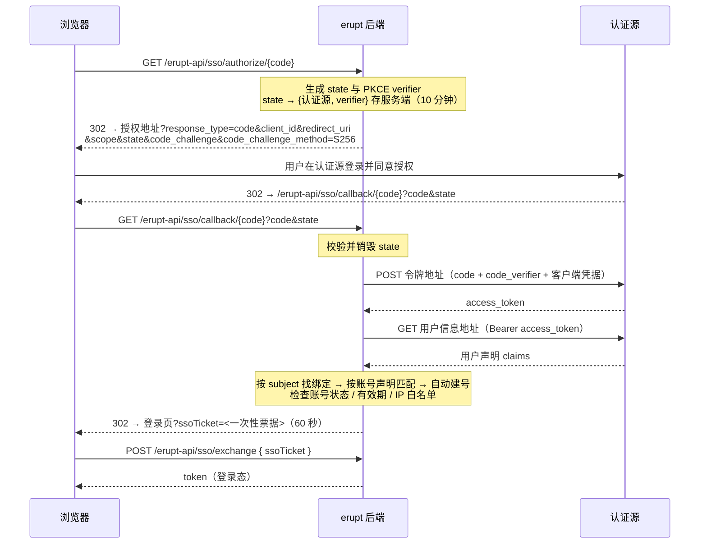

# Erupt SSO 单点登录

erupt-sso 让 erupt 把登录委托给外部认证源：Keycloak、Authing、Okta 这类 OIDC 服务，以及 GitHub、Gitee、飞书这类只提供 OAuth 2.0 的平台。认证源在后台**系统管理 → 单点登录**菜单里以数据行的形式配置：选一个供应商预设、粘贴客户端凭据即可，不写代码、不改配置文件、不重启，保存后登录页立刻出现对应按钮。

> 最低版本要求：**2.3.0**

模块走 OAuth 2.0 授权码流程并强制 PKCE；授权码在服务端换取访问令牌，令牌只用来调用一次用户信息接口，全程不解析 `id_token`，也不引入任何 JWT 库。

## 引入方式

```xml
<dependency>
  <groupId>xyz.erupt</groupId>
  <artifactId>erupt-sso</artifactId>
  <version>${erupt.version}</version>
</dependency>
```

`erupt-spring-boot-starter-all` 已包含本模块。模块依赖 `erupt-upms` 与 `erupt-data-jpa`，引入后自动装配，**系统管理** 下出现 **单点登录** 菜单（以及一个默认隐藏的 **单点登录绑定** 菜单，见下文）。

模块通过 `registerProp("erupt-sso")` 向前端宣告自己，登录页据此拉取认证源列表并渲染按钮；不引入模块的系统登录页保持原样，不会多出第二个入口。

## 工作原理



几个设计要点：

- **浏览器不携带任何可信状态**：`state` 只是一个键，对应服务端一条短时记录（认证源 + PKCE verifier），首次使用即销毁；同一个 `state` 不能拿到另一个认证源上重放。
- **令牌不进 URL**：回调后浏览器落回登录页时只带一张 60 秒有效的一次性票据，由前端通过 `POST /erupt-api/sso/exchange` 换成会话 token，token 不会出现在地址栏、历史记录和 Referer 里。
- **登录页地址不来自请求参数**：回调始终跳回 `erupt-app.login-page-path`（未配置时为 `<host>/#/passport/login`），不存在开放重定向。
- **令牌接口的客户端认证**：默认以 `client_secret_post` 方式提交；只有当 OIDC 发现文档声明仅支持 `client_secret_basic` 时才改用 HTTP Basic。
- **与密码登录同一条链路**：账号状态、有效期、IP 白名单检查以及 `LoginProxy` 的登录后处理对 SSO 登录同样生效。

### 四种交换方式

上图画的是标准 OAuth 2.0 的情况。浏览器带着 `code` 回来之后怎么交换，由认证源的**供应商类型**决定，共四种（`SsoProviderType.Flow`）：

| 方式 | 适用的供应商类型 | 交换过程 |
| --- | --- | --- |
| `OAUTH2` | 所有 OIDC 预设、GitHub、Gitee、飞书、Zoom，以及「自定义」 | 如上图：表单编码 POST 令牌地址得到 JSON，再以 Bearer 令牌 GET 用户信息地址 |
| `DINGTALK` | 钉钉 | 令牌请求是 JSON 体的 POST，得到的用户令牌放在钉钉自定义的请求头里去读 `contact/users/me` |
| `WECOM` | 企业微信 | 先用 CorpID + Secret 换企业 access_token，用它解析 `code` 得到成员 userid，再从通讯录读取资料；`snsapi_privateinfo` 返回的 user_ticket 换到的手机、邮箱、头像等敏感字段合并进声明。扫码的人不是企业成员时报「该账号不是企业成员」 |
| `WECHAT` | 微信开放平台 | 令牌与用户信息都是带查询参数的 GET；`openid` 从令牌响应中取出并传给用户信息接口 |

2.3.0 之前建好的行 `type` 列为空，按 `OAUTH2` 处理，行为不变。

## 配置认证源


**系统管理 → 单点登录**，新增一行即是一个认证源。通常的填写顺序是：先在「供应商类型」里选中对应的预设，表单自动填好接入地址、授权范围和声明字段；再把供应商控制台里拿到的客户端 ID / 密钥粘进来；自建服务的地址里会留有 `<host>`、`<realm>`、`<agentid>` 这类占位符，替换成实际值后保存。选「自定义」则所有字段手填，按标准 OAuth 2.0 处理。表单分四组：

### 基本信息

| 字段 | 说明 | 默认值 |
| --- | --- | --- |
| 供应商类型 Provider Type | 18 种预设（Keycloak、Authing、Casdoor、Okta、Auth0、Microsoft Entra ID、Google、GitLab、Atlassian、Slack、Zoom、GitHub、Gitee、飞书、钉钉、企业微信、微信开放平台）加「自定义」，见[供应商预设](#供应商预设)。选中预设后自动填入图标、签发者或三个地址、授权范围、账号 / 姓名 / 邮箱 / 手机 / 头像声明与 Open ID 字段；编码（预设名小写，如 `keycloak`）和名称只在为空时建议填入，已填的不覆盖；客户端 ID / 密钥下方的提示文字改为该供应商控制台的叫法（如 Entra 的「Application (client) ID」、飞书的「App ID」）。地址里预设留下的 `<placeholder>` 必须替换，否则保存被拒绝。类型还决定登录时的交换方式，见[四种交换方式](#四种交换方式) | 自定义 |
| 编码 Code | 2~32 位字母、数字、`-`、`_`，唯一。**出现在回调地址中**，保存后不可修改——改了会静默打断认证源侧已登记的回调 | — |
| 名称 Name | 登录页按钮上的文字，支持 i18n 词条 | — |
| 图标 Icon | Font Awesome 图标选择器，按钮上显示 | — |
| 状态 Status | 启用 / 停用，停用的认证源不出现在登录页且拒绝回调 | 启用 |
| 排序 Sort | 登录页按钮顺序，支持列表拖拽排序 | — |

### 接入地址

| 字段 | 说明 | 默认值 |
| --- | --- | --- |
| 签发者 Issuer | OIDC issuer。下面三个地址留空时，从 `<issuer>/.well-known/openid-configuration` 自动发现，结果按 issuer 缓存，行修改或删除后清除 | — |
| 授权地址 Authorize URL | authorization endpoint | 由 Issuer 发现 |
| 令牌地址 Token URL | token endpoint | 由 Issuer 发现 |
| 用户信息地址 User Info URL | userinfo endpoint | 由 Issuer 发现 |
| 回调地址 Redirect URI | 认证源把浏览器送回的地址，必须与认证源侧登记的**完全一致**。留空时按当前请求推算为 `http(s)://<本机地址>/erupt-api/sso/callback/<编码>`；只有在反向代理之后、或对外域名与后端不一致时才需要手填 | 留空自动推算 |

保存时校验：要么三个地址填全，要么填 Issuer 且它能返回发现文档。Issuer 没有发现文档（GitHub、Gitee、飞书都属于这一类）时保存被拒绝并提示「该 Issuer 没有 OpenID 发现文档，请手动填写授权、令牌和用户信息三个地址」，而不是等到有人登录时才失败。三个地址也可以只填部分，填了的覆盖发现结果。

### 客户端

| 字段 | 说明 | 默认值 |
| --- | --- | --- |
| 客户端 ID Client ID | 在认证源登记应用后得到 | — |
| 客户端密钥 Client Secret | 只写不读：列表里不显示，表单里以掩码回显，掩码原样提交时保留库中的值 | — |
| 消息推送凭据 Messaging Key | 只在供应商类型为企业微信、钉钉、Slack 时出现，同样只写不读。企业微信、钉钉填应用的 **AgentId**，Slack 填 **Bot User OAuth Token**（`xoxb-...`）。登录流程从不读取它，只有 erupt-notice 的[认证源推送渠道](/zh/modules/erupt-notice#认证源推送渠道)发消息时才用到；只做登录可留空 | — |
| 授权范围 Scopes | 标签输入，**以空格拼接**，预置 OIDC 标准范围 `openid` `profile` `email` `phone` `address` `groups`，认证源自定义的范围（如 GitHub 的 `read:user`）直接输入即可 | `openid profile email` |

### 用户映射

认证源返回的用户信息是一个 JSON 对象，这一组决定读哪些字段：

| 字段 | 说明 | 默认值 |
| --- | --- | --- |
| 账号声明 Account Claim | 首次登录时与 erupt 用户的**账号**做匹配的字段；该字段为空时退而使用邮箱声明 | `preferred_username` |
| 姓名声明 Name Claim | 映射到用户姓名 | `name` |
| 邮箱声明 Email Claim | 映射到用户邮箱 | `email` |
| 手机声明 Phone Claim | 映射到用户手机；OIDC 一般为 `phone_number`，飞书为 `mobile` | — |
| 头像声明 Avatar Claim | 头像图片 URL；OIDC 一般为 `picture`，飞书为 `avatar_url` | — |
| Open ID 字段 Open ID Claim | 其他模块（如消息通知）在供应商侧找到这个用户所用的标识字段：飞书 `open_id`、钉钉 `unionId`、企业微信 `userid`、Slack `https://slack.com/user_id`。取到的值存在绑定记录的 Open ID 列，每次登录刷新；留空则绑定上没有 Open ID，推送渠道无法触达该用户 | 由预设填入 |
| 同步资料 Sync Profile | **每次登录**：姓名、邮箱、手机、头像每次都以认证源为准覆盖；**仅补空字段**：只填充 erupt 中为空的字段，管理员手工改过的值得以保留 | 每次登录 |
| 自动建号 Auto Create | **创建**：未匹配到账号时按认证源资料创建用户；**拒绝**：提示「系统中不存在对应账号，请联系管理员」并带上账号声明的名称与值，方便管理员照着建号 | 创建 |
| 默认角色 Default Roles | 自动建号时赋予新用户的角色集合 | — |
| 登录时补齐角色 Grant Roles On Login | 开启后，已绑定用户每次登录都会补上缺少的默认角色；**只加不减**，管理员或其他认证源授予的角色不会被回收 | 关闭 |
| 备注 | 自由文本 | — |

用户的唯一标识（subject）不需要配置：模块依次尝试 `sub`、`id`、`openid`、`open_id`、`unionid`、`union_id`、`userId`、`user_id`，取第一个非空值。

## 账号绑定与自动建号

一次 SSO 登录如何落到 erupt 用户上：

1. **按绑定查找**：用「认证源 + subject」在绑定表中查找，命中即为该用户。绑定只认 subject，**从不**用邮箱或账号名做后续匹配——这两者会被改名和复用，subject 不会。
2. **首次登录按账号声明匹配**：没有绑定时，取账号声明（为空则取邮箱声明）的值，与 erupt 用户表的 `account` 比对。匹配到就为该用户建立绑定；这一步在整个绑定生命周期里只发生一次。
3. **自动建号**：仍未匹配到时，若开启「自动建号」，则创建用户：账号取账号声明的值，姓名取姓名声明（为空则用账号），状态启用、非管理员，赋予「默认角色」；用户**没有可用密码**（随机不可逆的哈希），只能通过认证源登录，也不会被提示修改初始密码。关闭「自动建号」则登录被拒绝。
4. **同步资料与补齐角色**：按「同步资料」与「登录时补齐角色」的设置更新姓名、邮箱、手机、头像与角色。
5. **可用性检查**：账号停用、过期、不在 IP 白名单内的用户即使认证源放行也会被拒绝，与密码登录一致。

:::tip 已有账号如何接入
让认证源的账号声明值与 erupt 里的账号名一致即可：用户第一次点 SSO 按钮登录时自动建立绑定，之后就算改了账号名也不影响。
:::

## 登录页表现


登录页在渲染时请求 `GET /erupt-api/sso/providers`，拿到启用中的认证源（编码、名称、图标，不含任何密钥）：

- 认证源不超过 3 个时并排一行，按钮显示图标与名称
- 超过 3 个时收成一排圆形图标按钮，悬停显示名称
- 点击按钮即跳转 `GET /erupt-api/sso/authorize/<编码>`，认证完成后回到登录页自动完成票据换取并进入系统
- 认证源拒绝授权或中途出错时，登录页显示错误提示（`ssoError` 参数），可直接重试

五种登录布局（`theme.loginLayout`）与 workspace 皮肤下按钮位置自动适配，无需额外设置。

## 供应商预设

「供应商类型」里的 18 个预设各自填好接入地址（OIDC 服务填签发者，其余填三个地址）、授权范围、声明映射和 Open ID 字段，留给你的只有供应商控制台里的客户端凭据，以及自建服务地址里的 `<placeholder>`。取值以发版时各供应商文档为准，登录失败时请对照其最新文档核对一遍。

| 类型 | 协议 | 需替换的占位符 | 账号声明 | Open ID 字段 | 备注 |
| --- | --- | --- | --- | --- | --- |
| Keycloak | OIDC 发现 | `<host>`、`<realm>` | `preferred_username` | — | 签发者 `https://<host>/realms/<realm>` |
| Authing | OIDC 发现 | `<app>` | `preferred_username` | — | 签发者 `https://<app>.authing.cn/oidc`，范围含 `phone` |
| Casdoor | OIDC 发现 | `<host>` | `preferred_username` | — | 姓名声明 `displayName`，手机声明 `phone` |
| Okta | OIDC 发现 | `<org>` | `preferred_username` | — | 签发者指向 `oauth2/default` 授权服务器 |
| Auth0 | OIDC 发现 | `<tenant>` | `nickname` | — | — |
| Microsoft Entra ID | OIDC 发现 | `<tenant-id>` | `email` | — | 客户端提示为「Application (client) ID」/「Client secret value」 |
| Google | OIDC 发现 | 无 | `email` | — | — |
| GitLab | OIDC 发现 | 无（自建实例改签发者即可） | `preferred_username` | — | 客户端提示为「Application ID」/「Secret」 |
| Atlassian | OIDC 发现 | 无 | `email` | `sub` | — |
| Slack | OIDC 发现 | 无 | `email` | `https://slack.com/user_id` | Slack 的声明以 URL 命名；要推送消息需在「消息推送凭据」里另填 Bot User OAuth Token |
| Zoom | OAuth2 | 无 | `email` | `id` | 令牌接口用 **HTTP Basic** 提交客户端凭据；范围 `user:read:user` |
| GitHub | OAuth2 | 无 | `login` | — | 范围 `read:user user:email`；用户把邮箱设为私密时 `email` 为空，只影响资料同步 |
| Gitee | OAuth2 | 无 | `login` | — | 范围 `user_info emails` |
| 飞书 Feishu | OAuth2 | 无 | `user_id` | `open_id` | 用户信息是信封式响应，模块自动拆开；范围为四项 `contact:user.*:readonly`；Lark 国际版把三个地址的域名改掉即可 |
| 钉钉 DingTalk | 钉钉 | 无 | `mobile` | `unionId` | 客户端提示为「AppKey」/「AppSecret」；推送消息时用 unionId 查一次企业 userid 并缓存，消息推送凭据填 AgentId |
| 企业微信 WeCom | 企业微信 | `<agentid>`（在授权地址中） | `userid` | `userid` | 客户端 ID 填 CorpID，密钥填自建应用的 Secret；消息推送凭据填同一个 AgentId |
| 微信开放平台 WeChat | 微信 | 无 | `openid` | `openid` | 网站应用扫码登录，范围 `snsapi_login` |
| 自定义 Custom | OAuth2 | — | 手填 | 手填 | 不改动表单，按标准 OAuth 2.0 处理 |

### Keycloak 示例

1. 供应商类型选 **Keycloak**，签发者会填成 `https://<host>/realms/<realm>`，把两个占位符换成实际值，如 `https://sso.example.com/realms/erupt`；三个地址由发现文档得出，不用填。
2. 在 Keycloak 中创建一个 confidential client，把 Client ID 与 Client Secret 粘到客户端一组。
3. 在该 client 的 **Valid redirect URIs** 中登记 `https://<erupt 域名>/erupt-api/sso/callback/keycloak`（`keycloak` 是预设建议的编码）。

Authing、Casdoor、Okta、Auth0、Entra ID 等其他 OIDC 预设同理：替换签发者里的占位符、粘贴凭据、登记回调。

### 飞书 / 企业微信 / 钉钉

这三家除了粘贴凭据，还要在各自的开放平台上做两件事：

- **登记回调地址**：把 `https://<erupt 域名>/erupt-api/sso/callback/<编码>` 加入应用的重定向 URL / 可信域名。
- **开通权限**：按预设填入的授权范围为应用开通对应权限——飞书的 `contact:user.*:readonly` 四项、企业微信的 `snsapi_privateinfo`（成员敏感信息）、钉钉的 `openid` 登录权限。

另外几点：企业微信要把授权地址里的 `<agentid>` 换成自建应用的 AgentId（若这行还要推送消息，「消息推送凭据」也填它）；飞书的用户信息接口返回 `{ "code": 0, "msg": "success", "data": { ... } }` 的信封结构，模块自动取 `data` 作为声明，`code` 非 0 时报「认证源响应异常 (code: msg)」，企业微信、钉钉的同类响应亦如此处理；Lark 国际版只需把三个地址的域名改为 Lark 的即可。

## 单点登录绑定管理

**单点登录绑定** 菜单记录「哪个 erupt 用户以哪个认证源的哪个 subject 登录」，以及登录时供应商返回的资料快照。绑定由登录动作自动产生，管理员只需要在排查问题或解绑时查看，因此该菜单默认 **隐藏**（`MenuStatus.HIDE`）：需要时在 **菜单维护** 中把它改为显示。也可以不显示菜单：在 **单点登录** 列表里对某个认证源行点击行下钻「单点登录绑定」，只看这一个认证源下的绑定。

| 列 | 说明 |
| --- | --- |
| 认证源 | 所属认证源 |
| 用户 | 绑定的 erupt 用户 |
| 主体标识 Subject | 认证源侧的唯一标识，由登录流程自动选取（`sub` / `id` / `open_id`…），不可配置 |
| Open ID | 按认证源的「Open ID 字段」映射出的消息标识，每次登录刷新；推送渠道以它为收件人 |
| 最近登录 Last Login | 最后一次通过该认证源登录的时间 |
| 用户信息 Claims | 最后一次登录时供应商返回的用户信息原文（JSON，已拆信封），每次登录整体重写。它只是快照，不是数据来源 |

菜单只允许查看与删除。删除一条绑定后，该用户下次通过这个认证源登录会重新走「按账号声明匹配 → 自动建号」流程。

### 供其他模块读取绑定

`EruptSsoBindService`（Spring Bean）把绑定上的信息暴露给其他模块。所有方法只读库中的绑定记录，**不会**向供应商发请求；用户从没通过某个认证源登录过就没有绑定，返回空：

| 方法 | 返回 |
| --- | --- |
| `find(userId, providerCode)` | `Optional<EruptSsoBind>`，用户与该认证源（按编码）的绑定 |
| `findAll(userId)` | `List<EruptSsoBind>`，用户登录过的所有认证源的绑定 |
| `openId(userId, providerCode)` | `Optional<String>`，绑定上的 Open ID |
| `claim(userId, providerCode, name)` | `Optional<String>`，用户信息快照中任意一个顶层字段，如飞书的 `tenant_key`、企业微信的 `department`，不需要为它加列；非基本类型返回其 JSON 文本 |
| `claims(userId, providerCode)` | `Optional<JsonObject>`，整份快照 |

```java
@Resource
private EruptSsoBindService eruptSsoBindService;

public void reachOnFeishu(Long userId) {
    // 用户在飞书侧的 open_id，只有通过编码为 feishu 的认证源登录过才有值
    eruptSsoBindService.openId(userId, "feishu").ifPresent(openId -> {
        // 拿 open_id 调用飞书接口……
    });
}
```

需要以**应用身份**（而不是用户身份）调用供应商接口的模块，可注入 `SsoProviderApi` 并调用 `appAccessToken(EruptSso)`：用该行的客户端凭据换取应用级令牌（飞书 `tenant_access_token`、钉钉 accessToken、企业微信 access_token），按行缓存到临近过期，行修改后自动失效；仅飞书、钉钉、企业微信三种类型支持，其他类型抛出「该供应商类型不支持以应用身份调用接口」。erupt-notice 的推送渠道正是这样发消息的。

## 接口

四个接口都**无需登录**即可访问——它们服务的正是尚未登录的用户，各自以 state、票据或「没有可保护的内容」为凭：

| 接口 | 说明 |
| --- | --- |
| `GET /erupt-api/sso/providers` | 启用中的认证源列表（编码、名称、图标），登录页渲染按钮用 |
| `GET /erupt-api/sso/authorize/{provider}` | 生成 state 与 PKCE 后 302 到认证源授权地址 |
| `GET /erupt-api/sso/callback/{provider}` | 认证源回调地址；成功则 302 到登录页并带 `ssoTicket`，失败带 `ssoError` |
| `POST /erupt-api/sso/exchange` | 请求体 `{ "ssoTicket": "..." }`，返回与密码登录相同的 `LoginModel`（含 token）；票据一次性、60 秒有效，过期返回「登录凭证已失效，请重新登录」 |

常见错误提示与含义：

| 提示 | 场景 |
| --- | --- |
| 登录请求已失效，请重新发起 | state 缺失、过期（10 分钟）、已使用或不属于该认证源 |
| 认证源不存在或已停用 | 编码错误或行被停用 |
| 该 Issuer 没有 OpenID 发现文档… | 保存时 Issuer 无法发现三个地址 |
| 获取访问令牌失败 | 令牌接口未返回 `access_token`，多为客户端 ID / 密钥 / 回调地址不匹配 |
| 认证源响应异常 (…) | 令牌或用户信息接口返回非 2xx、非 JSON，或信封 `code` 非 0；括号内是认证源自己的错误码与文案 |
| 认证源未返回用户标识 | 用户信息中没有任何可作 subject 的字段，括号内列出实际返回的字段名 |
| 认证源未返回账号信息 | 账号声明与邮箱声明都为空 |
| 系统中不存在对应账号，请联系管理员 | 自动建号关闭且未匹配到账号，括号内给出声明名与值 |
| 请先替换地址中的占位符 (…) | 保存时地址里还留着预设的 `<host>`、`<realm>`、`<agentid>` 之类占位符，括号内是那条地址 |
| 该账号不是企业成员 | 企业微信：扫码的账号不在该企业的通讯录里 |
| 该供应商类型不支持以应用身份调用接口 | 对不是飞书 / 钉钉 / 企业微信的行调用了 `SsoProviderApi.appAccessToken` |

## 数据表

| 表 | 说明 |
| --- | --- |
| `e_upms_sso` | 认证源，继承 `MetaModelUpdateVo`；字段与表单一致：`type` VARCHAR(32)（供应商类型枚举名，2.3.0 前建的行为空，按自定义处理）、`code`（唯一）、`name`、`icon`、`status`、`sort`、`issuer`、`authorize_url`、`token_url`、`user_info_url`、`redirect_uri`（均 VARCHAR(512)）、`client_id`、`client_secret` VARCHAR(512)、`messaging_key` VARCHAR(255)、`scopes` VARCHAR(255)、`account_claim` / `name_claim` / `email_claim` / `phone_claim` / `avatar_claim` / `open_id_claim` VARCHAR(64)、`sync_profile`、`auto_create`、`grant_roles_on_login`、`remark` |
| `e_upms_sso_role` | 认证源默认角色，`sso_id` + `role_id` |
| `e_upms_sso_bind` | 绑定，继承 `MetaModelUpdateVo`：`sso_id`、`erupt_user_id`、`subject` VARCHAR(255) NOT NULL、`open_id` VARCHAR(255)、`last_login_time` DATETIME(6)、`claims` VARCHAR(10485760)（`AnnotationConst.CONFIG_LENGTH`，MySQL 上映射为 LONGTEXT）；唯一约束 `(sso_id, subject)` |

开启 JPA 自动建表的项目升级后自动创建；手工维护表结构的项目请按上表建表。

:::tip 与 Spring Security OAuth2 方案的关系
2.3.0 之前文档推荐的做法是引入 `spring-boot-starter-oauth2-client`，在 `application.yml` 中配置认证源并自行编写回调 Controller 换取 erupt token，见 [登录与认证 → 进阶：Spring Security OAuth2 Client](/zh/advanced/auth#进阶-spring-security-oauth2-client)。该方案仍然可用，适合需要深度定制授权流程的场景；一般接入建议直接使用 erupt-sso，在后台配置即可，不需要写代码和重启。
:::
