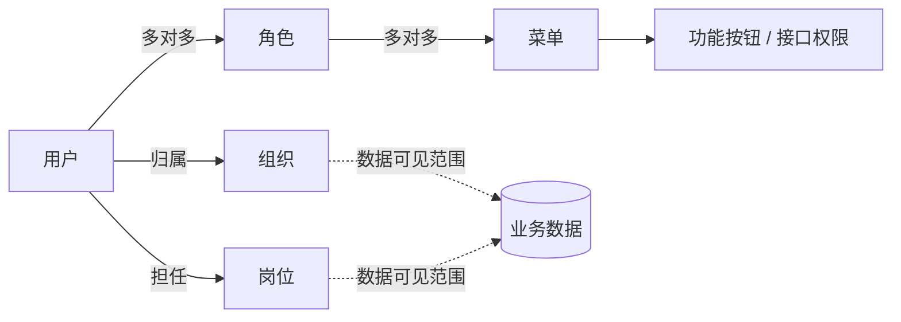

# Erupt Upms 权限管理

erupt-upms 是 Erupt 的用户权限管理系统（User Permission Management System）：用户、角色、菜单、组织、岗位、字典、Open API、在线用户与三类日志，全部由 `@Erupt` 注解生成，不需要额外写一行界面代码。

它解决的是每个后台都绕不开、又最不该重复造的那部分：**谁能登录、登录后能看到哪些菜单、在菜单里能按哪些按钮、看到哪些数据，以及事后如何追溯。**

## 引入方式

`erupt-upms` 已包含在 `erupt-admin` 中，无需单独引入：

```xml
<dependency>
  <groupId>xyz.erupt</groupId>
  <artifactId>erupt-admin</artifactId>
  <version>${erupt.version}</version>
</dependency>
```

启动后使用默认账号登录（可通过 `erupt.upms.default-account` / `default-password` 修改，见[参数配置](/zh/guide/configuration)）：

| 账号 | 密码 |
| --- | --- |
| erupt | erupt |

## 权限模型



- **菜单**是权限的最小单位：一个 Erupt 类对应一个菜单，其新增 / 修改 / 删除 / 导出等按钮会自动生成为子菜单，勾选即授权。
- **角色**是菜单的集合，用户可拥有多个角色，权限取并集。
- **组织与岗位**不参与菜单授权，而是用来划定**数据可见范围**：业务实体继承 `LookerOrg` / `LookerPostLevel` / `LookerSelf` 后，非管理员只能看到本组织、本组织下级岗位或自己创建的数据。
- **超级管理员**（用户上的「管理员」开关）跳过所有菜单与数据过滤。

## 功能导航

初始化后「系统管理」目录下的菜单，与本模块各页面一一对应：

| 页面 | 解决的问题 |
|---|---|
| [菜单管理](/zh/modules/erupt-upms/menu) | 系统里有哪些页面、按钮与接口，分别用什么方式打开 |
| [角色管理](/zh/modules/erupt-upms/role) | 把菜单打包成岗位职责，并防止操作者越权分配 |
| [组织与岗位](/zh/modules/erupt-upms/org-post) | 组织树与岗位层级，以及基于它们的数据可见范围 |
| [用户管理](/zh/modules/erupt-upms/user) | 账号生命周期：密码策略、锁定、有效期、IP 白名单、重置密码 |
| [字典管理](/zh/modules/erupt-upms/dict) | 把散落在代码里的枚举变成可在线维护的 key-value |
| [Open API](/zh/modules/erupt-upms/open-api) | 给外部系统发放 APPID + Secret，以某个用户的权限调用接口 |
| [在线用户](/zh/modules/erupt-upms/online) | 谁正在线、从哪登录，一键强制下线 |
| [登录日志与操作日志](/zh/modules/erupt-upms/log) | 谁在何时何地做了什么、改前数据是什么、耗时多少、是否报错 |
| [系统日志](/zh/modules/erupt-upms/system-log) | 不登服务器，在浏览器里实时看应用日志 |

## 相关扩展点

权限系统的代码级扩展分散在「进阶」章节，这里列出入口：

| 需求 | 文档 |
|---|---|
| 自定义登录逻辑（对接 LDAP / SSO / 短信验证码） | [登录与认证 LoginProxy](/zh/advanced/auth) |
| 替换登录页 | [自定义登录页](/zh/advanced/custom-login-page) |
| 自己写的接口要求登录或菜单权限 | [REST API 接口权限](/zh/advanced/rest-api) |
| 按组织 / 岗位 / 创建人过滤数据 | [PreDataProxy 与 Looker](/zh/advanced/pre-data-proxy) |
| 字典作为下拉选项 | [单选 CHOICE → 字典选项](/zh/field-types/choice#字典选项) |
| 水印、验证码次数、Session 时长等 | [参数配置](/zh/guide/configuration) |
