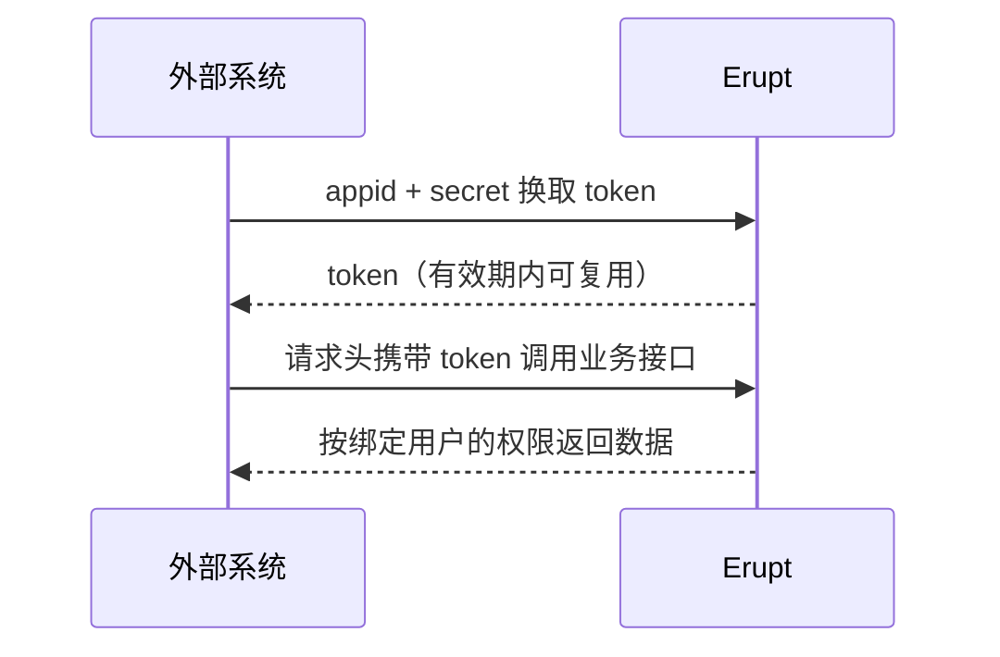

# Open API

Open API 用于给**外部系统**发放接入凭证。外部系统凭 APPID + Secret 换取 erupt token，之后就能以**所绑定用户的权限**调用受保护的 erupt 接口，包括任意 Erupt 类的增删改查。

对比直接共享某个人的账号密码，这种方式的好处是：凭证可随时吊销、可单独设置有效期、密钥只在创建时完整展示一次、每个外部系统一条记录便于审计。

## 配置项

| 字段 | 说明 |
| --- | --- |
| APPID | 自动生成，`es` 前缀 + 14 位随机串 |
| 名称 | 标识接入方，如「ERP 同步」 |
| Token 有效期 | 分钟，默认 3600 |
| 绑定用户权限 | 外部系统调用接口时使用该用户的菜单权限与数据范围。建议为每个接入方单独创建最小权限用户 |
| 状态 | 停用后当前已发放的 token 立即失效 |
| 密钥 | 自动生成 24 位大写随机串。列表中只显示首尾 4 位，中间以 `*` 遮蔽 |

## 密钥管理

- 行操作**更新密钥**会生成新密钥并弹窗展示一次，旧密钥立即失效。
- 停用或删除记录时，已签发的 token 一并注销。

## 调用流程

接口地址、参数与示例代码见 [Open API 开放接口 →](/zh/advanced/open-api)
