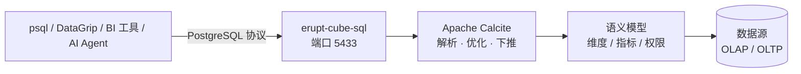

# SQL 查询端口

`erupt-cube-sql` 模块将语义模型以 **PostgreSQL 协议**对外暴露：每个 Cube 都是一张可直接 `SELECT` 的表，任何支持 PostgreSQL 的客户端 —— `psql`、DataGrip、DBeaver、Superset、Metabase、Grafana，乃至通过 JDBC 接入的 AI Agent —— 都可以直连语义层查询数据，指标口径依然由语义模型统一收口。



:::tip 为什么需要 SQL 端口
拖拽分析覆盖了业务人员，但数据工程师、外部 BI 工具和 AI Agent 更习惯用 SQL 对话。SQL 端口让它们复用同一套语义层：**查的是 Cube，而不是底表** —— 指标聚合逻辑、行级权限、多数据源路由全部继续生效。
:::

## 快速开始

### 1. 添加依赖

```xml
<dependency>
    <groupId>xyz.erupt</groupId>
    <artifactId>erupt-cube-sql</artifactId>
    <version>${LATEST-VERSION}</version>
</dependency>
```

### 2. 配置

```yaml
erupt:
  cube:
    sql:
      enable: true        # 默认 true，引入依赖即启用
      show-sql: true      # 打印端口收到的每条 SQL（默认 true）
      bind: 127.0.0.1     # 监听地址，对外提供服务时改为 0.0.0.0
      port: 5433          # 监听端口
      username: erupt     # 连接用户名
      password:           # 留空为 trust 模式（免密）；设置后启用 md5 认证
```

### 3. 连接

```bash
psql -h 127.0.0.1 -p 5433 -U erupt
```

或使用任意 PostgreSQL JDBC 连接串：

```
jdbc:postgresql://127.0.0.1:5433/erupt
```

## 查询模型

### Cube 即表

每个 `@EruptCube` 类都是一张表，表名即类名（**大小写不敏感**，可任意书写）：

```sql
select category, sum(revenue) as revenue
from SalesCube
group by category
order by category;
```

### 指标自动聚合

指标列（`@Measure`）自带聚合语义 —— 直接投影指标时，无需手写 `GROUP BY`，会自动按所选维度的粒度聚合：

```sql
-- 等价于 group by region_code 后对 revenue 求 sum
select region_code, revenue from SalesCube;
```

### 谓词下推

- 维度过滤（`=`、`IN`、`LIKE 'xx%'` 等）会下推到 Cube 的 `WHERE`，由底层数据源执行；
- 指标条件自动路由为对应粒度的 `HAVING`：

```sql
-- revenue 是指标，此条件生成 HAVING sum(revenue) > 1000
select region_code, revenue from SalesCube where revenue > 1000;
```

- 无法下推的表达式（如 `upper(category) = 'X'`、跨列 `OR`）由 Calcite 在内存中计算，结果仍然正确。

### 查询视图（Explore）

带 Join 或固定过滤条件的 Explore 以 `"Cube.explore"` 形式暴露为独立的表：

```sql
select continent, revenue from "SalesCube.with_region" order by continent;
```

### 查询参数（@Parameter）

`@Parameter` 字段以 WHERE 等值条件的形式传入，它不过滤结果集，而是**绑定 Velocity 模板上下文**，参与 Cube 底表 SQL 的动态生成：

```sql
select sum(revenue) as revenue from SalesCube where category_filter = 'Clothing';
```

### 跨 Cube 关联

不同 Cube 之间可以直接 JOIN，由 Calcite 在内存中完成关联：

```sql
select r.continent, sum(s.revenue) as revenue
from SalesCube s
  join RegionCube r on s.region_code = r.region_code
group by r.continent;
```

### 模型发现

虚拟表 `erupt_cubes` 列出所有 Cube、Explore 与字段，`pg_tables` / `information_schema` 同样可用：

```sql
select distinct cube from erupt_cubes;
select tablename from pg_tables;
```

## 客户端兼容性

端口内置了 `pg_catalog` 仿真（`pg_class`、`pg_attribute`、`pg_type`、`pg_namespace` 等），完整支持 pgjdbc 的 `DatabaseMetaData` 元数据 API 与 DataGrip 的对象内省，因此在图形化工具里可以像浏览普通 PostgreSQL 库一样浏览 Cube 的表结构、获得列名补全。

- 支持简单查询协议与扩展查询协议（Prepared Statement、文本/二进制结果编码、Bind 参数）
- 会话语句（`SET` / `SHOW` / `BEGIN` ...）按 PostgreSQL 语义应答
- `LIMIT` / `OFFSET`、`ORDER BY`、`DISTINCT`、列投影与类型转换（如 `col::bigint`）均可用

## 只读语义

端口是**只读**的：`INSERT` / `UPDATE` / `DELETE` / `DDL` 一律以 SQLSTATE `25006`（`read_only_sql_transaction`）拒绝，行为与 PostgreSQL 只读从库一致，`transaction_read_only` 报告为 `on`。写入被拒绝后连接仍可继续查询。

## 扩展执行器

真实 `SELECT` 默认由基于 **Apache Calcite** 的 `CalciteCubeSqlExecutor` 解析执行（语义层下推）。如需自定义执行逻辑，注册自己的 `CubeSqlExecutor` Bean 即可整体替换：

```java
@Component
public class MyCubeSqlExecutor implements CubeSqlExecutor {
    // 自定义 SQL → 语义层查询的解析与执行
}
```

## 典型场景

| 场景 | 说明 |
| --- | --- |
| BI 工具直连 | Superset / Metabase / Grafana 选 PostgreSQL 数据源即可接入，无需插件 |
| AI Agent 查数 | Agent 通过 JDBC/psql 用 SQL 提问，语义层保证指标口径与数据权限 |
| 数据工程师即席查询 | 在 DataGrip / DBeaver 里直接探查 Cube，替代手写底表 SQL |
| 下游系统取数 | 任何有 PostgreSQL 驱动的语言（Python、Go、Node.js）都能读取语义层数据 |
