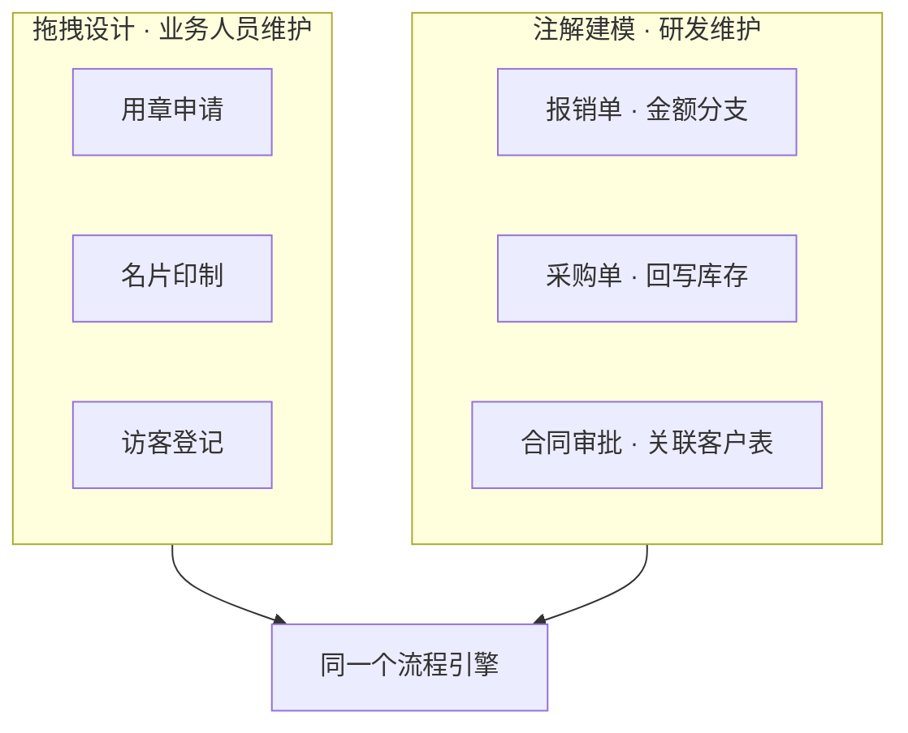

# 审批表单

erupt-flow 的审批表单就是一个 Erupt 模型。定义这个模型有两条路：**拖拽设计**和**注解建模**。两者产出的都是标准 Erupt 模型，在流程配置界面中并列出现，选哪个由这张表单的复杂度决定，而不是由技术栈决定。

| | 拖拽设计 | 注解建模 |
|---|---|---|
| 谁来做 | 业务 / 实施人员 | 研发人员 |
| 在哪做 | 浏览器中的表单设计器 | Java 源码 |
| 生效方式 | 发布即生效，不重启 | 编译部署 |
| 数据存放 | 内嵌 SQLite 文件 | 项目主数据库 |
| 适合 | 字段平铺、规则简单的审批单 | 需要联动、校验、回调、与业务表关联 |

一套系统里两种方式可以并存：常规的请假、用章、报销单交给业务人员拖，涉及金额试算、库存校验、回写业务状态的单据由研发写注解。

## 方式一：拖拽设计

引入 [erupt-designer](/zh/modules/erupt-designer) 后即可使用，无需为流程做额外配置。

```xml
<dependency>
    <groupId>xyz.erupt</groupId>
    <artifactId>erupt-designer</artifactId>
    <version>${erupt.version}</version>
</dependency>
```


步骤：

1. 进入 **Form Designer** 菜单，新建一条记录，填写类名与名称。
2. 点击行按钮 **Design** 进入设计器，拖拽添加文本、数字、日期、下拉、附件等字段并配置属性。
3. 点击 **Preview** 预览，确认后发布。
4. 到流程配置中新建流程，**关联表单**下拉里就能选到这个模型。

:::tip 为什么不用手动声明
同时引入 erupt-designer 与 erupt-flow 时，设计器生成的运行时类会自动带上 `@EruptFlow` 标记（v2.2.0+），因此**每一个发布的设计模型都自动具备流程能力**，不需要在设计器里勾选任何"启用流程"开关。
:::

设计模型的业务数据存放在内嵌 SQLite 文件中（默认 `data/designer.db`），与主库解耦。部署时记得把该文件挂到持久卷，详见 [erupt-designer → 数据存储](/zh/modules/erupt-designer#数据存储)。

### 能力边界

拖拽方式下有三件事做不到，需要时请改用注解建模：

| 限制 | 说明 |
|---|---|
| 条件分支不能引用表单字段 | 网关分支的条件是对表单模型执行一次数据库查询来判定的，而设计模型的数据不在主库中。需要"金额 > 5000 走总经理审批"这类分支时，请用注解模型 |
| 没有流程回调 | `FlowProxy` 通过 `@EruptFlow(flowProxy = ...)` 绑定，设计模型无法指定，因此拿不到 `onNodeStart` / `onNodeEnd` / `onReject` 回调 |
| 无法与业务表建立外键关联 | 设计模型不是 JPA 实体，引用类字段以 JSON 形式保存快照，不能作为业务表的外键参与联表统计 |

不受影响的能力：发起、审批、抄送、加签、驳回、流程通知、[流程打印](/zh/modules/pro/erupt-flow/print)、Flex 自动节点中基于 `${form.字段}` 的表达式取值，都照常可用。

## 方式二：注解建模

在任意 Erupt 类上加 `@EruptFlow`，它就出现在流程配置的表单下拉中：

```java
@EruptFlow
@Erupt(name = "请假申请")
@Table(name = "biz_leave")
@Entity
@Getter
@Setter
public class Leave extends BaseModel {

    @EruptField(
        views = @View(title = "请假类型"),
        edit = @Edit(title = "请假类型", type = EditType.CHOICE, notNull = true,
                     choiceType = @ChoiceType(vl = {
                         @VL(value = "1", label = "年假"),
                         @VL(value = "2", label = "事假"),
                         @VL(value = "3", label = "病假")
                     }))
    )
    private String type;

    @EruptField(
        views = @View(title = "天数"),
        edit = @Edit(title = "天数", type = EditType.NUMBER, notNull = true)
    )
    private Double days;
}
```


注解方式额外能用到的：

- **条件分支**：网关可以直接对 `days`、`type` 等字段设条件，决定走哪条审批线。
- **流程回调**：`@EruptFlow(flowProxy = LeaveFlowProxy.class)` 绑定回调，在节点开始 / 结束 / 驳回时写业务状态、发通知、调外部接口，见[流程开发 → 流程回调](/zh/modules/pro/erupt-flow/development#流程回调-flowproxy)。
- **完整的字段能力**：字段联动（`trigger`）、`DataProxy` 校验、`@EruptField` 的全部组件与表达式，与普通 Erupt 模型完全一致。
- **原生关联**：表在主库中，可与其他业务表做 JPA 关联、联表统计、直接写 SQL 报表。

## 两者混用

同一套系统里，常见的分法是：



判断口径很简单：**这张单子审批完只是"存个档"，就拖；审批完要触发系统里的其他动作，或者审批路径取决于表单填了什么，就写注解。**

## 从拖拽迁移到注解

表单在设计器里跑了一段时间后，如果需求长出了分支或回调，可以平滑转成注解模型：

1. 在设计器中点击 **Export Code**，导出标准 Java 注解代码。
2. 把代码放进项目，**换一个类名**，补上 `@Entity`、`@Table` 与 `@EruptFlow`。
3. 编译部署后，在流程配置中把关联表单切到新模型。

:::warning 历史数据不会自动搬家
设计模型的数据在 SQLite 中，注解模型的数据在主库中，切换表单不会迁移已有单据。已发起的流程实例仍指向原模型，请保留原设计不要删除，或先导出数据再手工导入。
:::
